# Multi-Agent Architecture

This document defines the structure and responsibilities of ValarMind Code's specialized agents, a multi-agent system for software development.

## Overview

ValarMind Code uses a hierarchical orchestration model where a main agent (Orchestrator) coordinates specialist agents. Each agent has a limited scope, specific tools, and clear objectives.

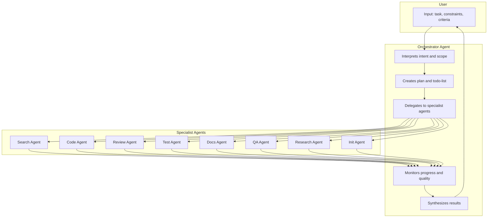

## Orchestrator Agent

The central agent that coordinates the entire development flow.

### Responsibilities

| Function | Description |
|----------|-------------|
| Interpretation | Analyzes user intent, scope, risks, and success criteria |
| Planning | Creates execution plan with stages, checkpoints, and verification strategy |
| Todo-list | Generates and manages task list with dependencies and priorities |
| Delegation | Selects specialist agents and defines tool limits |
| Monitoring | Tracks progress, detects blockers, and adjusts plan |
| Synthesis | Consolidates results and presents to user |
| Quality Gates | Defines quality criteria and triggers mandatory Review/QA for complex implementations |

### Tools

| Tool | Usage |
|------|-------|
| TaskCreate | Creates tasks in the todo-list |
| TaskUpdate | Updates status and dependencies |
| TaskList | Lists tasks and progress |
| AgentSpawn | Starts specialist agents with context and limits |
| AgentMonitor | Monitors agent execution |
| PlanCreate | Creates structured plan |
| CheckpointCreate | Creates verification points |
| ResearchRequest | Requests research from Research Agent to inform decisions |

### Decision Cycle

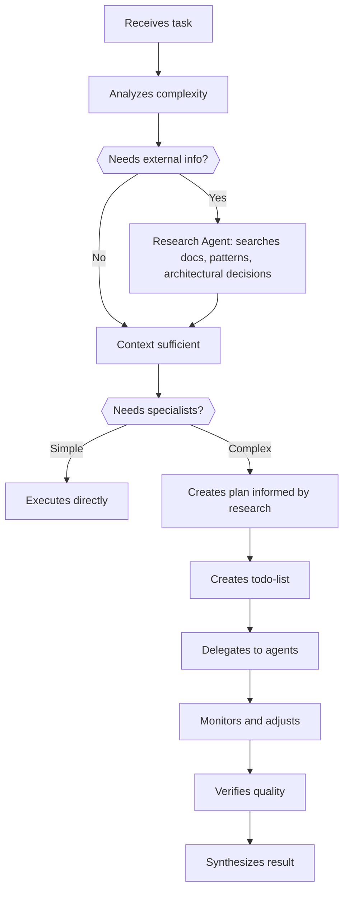

### Using Research Agent in Planning

The Orchestrator uses the Research Agent to inform decisions during plan creation:

| Situation | Query for Research Agent |
|-----------|--------------------------|
| Lib/framework choice | "compare prisma vs drizzle 2024 performance" |
| Architectural pattern | "hexagonal architecture typescript implementation" |
| Problem approach | "best practice handle rate limiting nodejs" |
| Unknown technology | "fastify websocket plugin documentation" |
| Security decision | "jwt refresh token rotation best practice" |

This ensures the plan is created based on up-to-date information and community best practices.

### Delegation Strategy

The Orchestrator decides which agent to use based on:

1. **Task type**: search, code, test, documentation, review
2. **Flow phase**: discovery, implementation, verification
3. **Dependencies**: tasks that block others
4. **Resources**: required tools vs available ones

### Quality Gates Strategy

The Orchestrator triggers **mandatory** verification by Review and QA when:

**Complexity Criteria (any one triggers):**

| Criterion | Description | Review | QA |
|-----------|-------------|--------|-----|
| Multi-file | Change affects 2+ files | ✓ | ✓ |
| Risk code | Auth, payment, security, sensitive data | ✓ | ✓ |
| Significant refactoring | Module or pattern restructuring | ✓ | ✓ |
| Public API change | External contracts altered | ✓ | ✓ |
| Orchestrator decision | Explicit judgment of necessity | ✓ | ✓ |

**Simple implementations** (single-file, low risk, no sensitive data): Review and QA are **optional**, at Orchestrator's discretion.

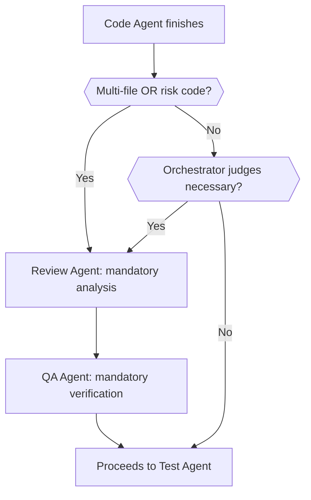

---

## Search Agent (Explore)

Agent specialized in codebase discovery and exploration. Read-only mode.

### Responsibilities

| Function | Description |
|----------|-------------|
| Discovery | Maps project structure, modules, and dependencies |
| Semantic search | Finds code by intent, not just text |
| Symbol analysis | Identifies classes, functions, types, and relationships |
| Context | Collects information needed by other agents |

### Tools

| Tool | Permission | Usage |
|------|------------|-------|
| read_file | Read | Read files |
| glob | Read | Search files by pattern |
| grep | Read | Search content in files |
| tree_view | Read | Visualize directory structure |
| git_diff | Read | Analyze changes in commits/branches |

### Restrictions

- **Read-only**: cannot edit, create, or delete files
- **No execution**: cannot run shell commands
- **Timeout**: time limit per search to avoid loops

### Expected Output

```typescript
interface SearchResult {
  query: string;
  findings: Finding[];
  summary: string;
  confidence: number;
  suggestedNextSteps?: string[];
}

interface Finding {
  file: string;
  line?: number;
  snippet?: string;
  relevance: number;
  context?: string;
}
```

---

## Research Agent (Web)

Agent specialized in external internet research. Searches documentation, solutions, vulnerabilities, best practices, and up-to-date information.

### Responsibilities

| Function | Description |
|----------|-------------|
| Documentation | Searches official docs for libs, frameworks, and APIs |
| Solutions | Researches solutions for errors, bugs, and technical problems |
| Vulnerabilities | Consults CVEs, advisories, and known security issues |
| Best Practices | Searches recommended patterns and community conventions |
| Updates | Checks versions, changelogs, and breaking changes |
| Examples | Finds code examples and reference implementations |

### Tools

| Tool | Permission | Usage |
|------|------------|-------|
| read_file | Read | Read local files for context |
| glob | Read | Search files by pattern |
| grep | Read | Search content in files |
| web_fetch | Read | Fetch URLs and convert HTML to Markdown |

> **Web Search**: The Research Agent uses the OpenRouter `:online` model suffix (`modelSuffix: ':online'`) for automatic web grounding. Search results are included inline by the model — no separate tool is needed. MCP tools are available when configured (Research Agent has `*` access to all MCP servers).

### Restrictions

- **Read-only**: does not modify local files
- **No execution**: does not run commands
- **Trusted sources**: prioritizes official documentation, GitHub, StackOverflow
- **Cache**: stores results to avoid repeated searches
- **Rate limiting**: respects external API limits

### Search Strategy

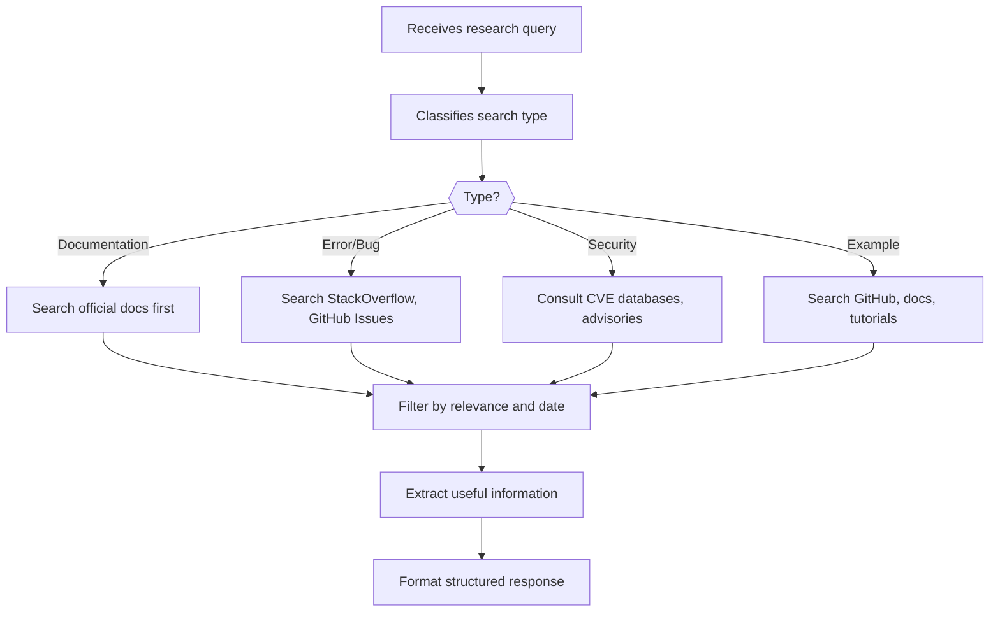

### Use Cases

| Requester | Use Case | Example Query |
|-----------|----------|---------------|
| Code Agent | How to use a lib | "fastify jwt authentication example typescript" |
| Review Agent | Check vulnerability | "CVE lodash prototype pollution 2024" |
| Test Agent | Testing patterns | "bun test mocking best practices" |
| Docs Agent | Documentation syntax | "jsdoc typescript async function" |
| QA Agent | Quality patterns | "typescript strict mode recommended settings" |
| Orchestrator | Architectural decision | "prisma vs drizzle orm comparison 2024" |

### Integration with Other Agents

The Research Agent can be invoked by any agent through the Orchestrator:

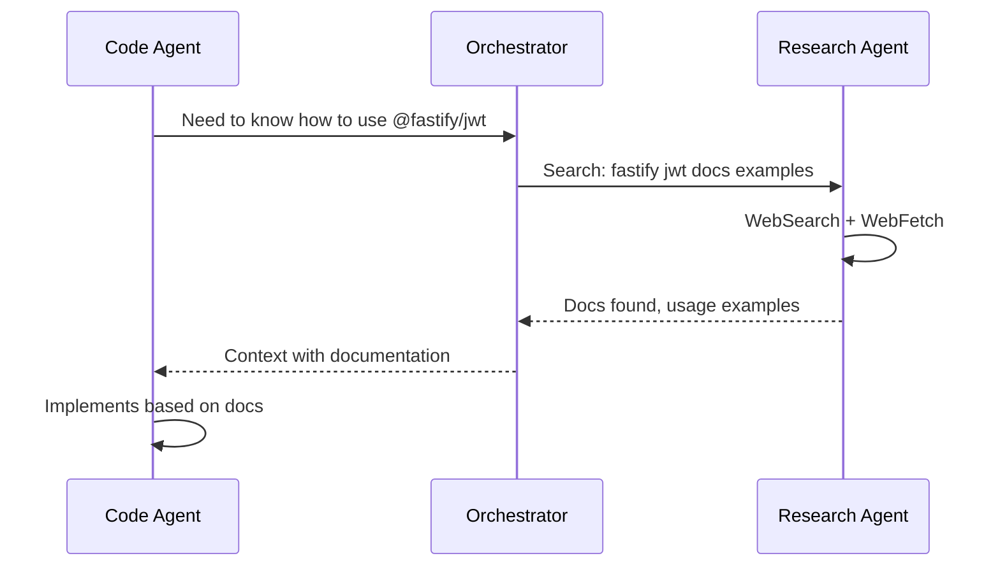

### Expected Output

```typescript
interface ResearchResult {
  query: string;
  type: 'documentation' | 'solution' | 'security' | 'example' | 'general';
  sources: Source[];
  summary: string;
  relevantSnippets: Snippet[];
  confidence: number;
  cachedAt?: string;
}

interface Source {
  url: string;
  title: string;
  type: 'official_docs' | 'github' | 'stackoverflow' | 'blog' | 'other';
  reliability: number; // 1-10
  date?: string;
}

interface Snippet {
  content: string;
  language?: string;
  source: string;
  context?: string;
}
```

### Source Priority

| Priority | Source Type | Reliability |
|----------|-------------|-------------|
| 1 | Official documentation | High |
| 2 | GitHub (official repos) | High |
| 3 | StackOverflow (accepted answers) | Medium-High |
| 4 | Well-known tech blogs | Medium |
| 5 | Tutorials and articles | Medium-Low |
| 6 | Forums and discussions | Low |

### Cache and Optimization

- Results are cached for 24h (configurable)
- Similar queries reuse cache
- Official documentation has longer cache (7 days)
- CVEs and advisories have short cache (1h)

---

## Code Agent

Agent specialized in writing and modifying code.

### Responsibilities

| Function | Description |
|----------|-------------|
| Implementation | Writes new code following project patterns |
| Modification | Edits existing code with precision |
| Refactoring | Restructures code while maintaining behavior |
| Fixes | Fixes identified bugs |

### Tools

| Tool | Permission | Usage |
|------|------------|-------|
| Read | Read | Read files for context |
| Edit | Write | Edit existing files |
| Write | Write | Create new files |
| Glob | Read | Find related files |
| Grep | Read | Search content in files |
| RepoMap | Read | Structural map of code (functions, classes, signatures) |

### Restrictions

- **Limited scope**: only edits files specified in the task
- **Mandatory checkpoint**: creates backup before edits
- **Validation**: code must pass lint before finalizing
- **No tests**: does not run tests (delegated to Test Agent)

### Quality Standards

1. Follow project conventions (from VALARMIND.md)
2. Maintain consistency with existing code
3. Avoid over-engineering
4. Document only when necessary

### Expected Output

```typescript
interface CodeResult {
  task: string;
  filesModified: FileChange[];
  filesCreated: FileChange[];
  summary: string;
  lintPassed: boolean;
  warnings?: string[];
}

interface FileChange {
  path: string;
  diff: string;
  linesChanged: number;
}
```

---

## Review Agent

Agent specialized in code review and quality analysis.

### Responsibilities

| Function | Description |
|----------|-------------|
| Code Review | Analyzes code changes for quality and standards |
| Security | Identifies vulnerabilities and security issues |
| Performance | Detects performance issues and optimizations |
| Architecture | Verifies adherence to architectural patterns |
| Suggestions | Proposes improvements and alternatives |

### Tools

| Tool | Permission | Usage |
|------|------------|-------|
| Read | Read | Read files for analysis |
| Glob | Read | Find related files |
| Grep | Read | Search for problematic patterns |
| GitDiff | Read | Analyze changes in commits/branches |
| RepoMap | Read | Structural map of code (functions, classes, signatures) |

### Restrictions

- **Read-only**: does not modify code
- **Non-blocking**: suggests, does not impose
- **Objective**: focuses on real issues, not stylistic ones

### Review Checklist

| Category | Checks |
|----------|--------|
| Correctness | Correct logic, edge cases handled, correct types |
| Security | Validated inputs, no injection, protected secrets |
| Performance | No N+1, acceptable complexity, controlled memory |
| Maintenance | Readable code, clear names, no excessive duplication |
| Tests | Adequate coverage, relevant cases tested |

### Expected Output

```typescript
interface ReviewResult {
  filesReviewed: string[];
  issues: ReviewIssue[];
  suggestions: Suggestion[];
  overallScore: number; // 1-10
  summary: string;
  approved: boolean;
}

interface ReviewIssue {
  severity: 'critical' | 'major' | 'minor' | 'info';
  file: string;
  line?: number;
  message: string;
  category: string;
}

interface Suggestion {
  file: string;
  line?: number;
  current: string;
  suggested: string;
  reason: string;
}
```

---

## Test Agent

Agent specialized in testing and validation.

### Responsibilities

| Function | Description |
|----------|-------------|
| Execution | Runs unit, integration, and E2E tests |
| Writing | Creates new tests for modified code |
| Coverage | Analyzes and reports test coverage |
| Diagnosis | Investigates failures and identifies root cause |

### Tools

| Tool | Permission | Usage |
|------|------------|-------|
| Read | Read | Read test files and code |
| Write | Write | Create new test files |
| Edit | Write | Edit existing tests |
| Bash | Execute | Run test commands |
| Glob | Read | Find test files |
| Grep | Read | Search content in test/code files |

### Restrictions

- **Execution scope**: only permitted test commands
- **No production code**: does not edit source code, only tests
- **Timeout**: time limit for test execution

### Testing Strategy

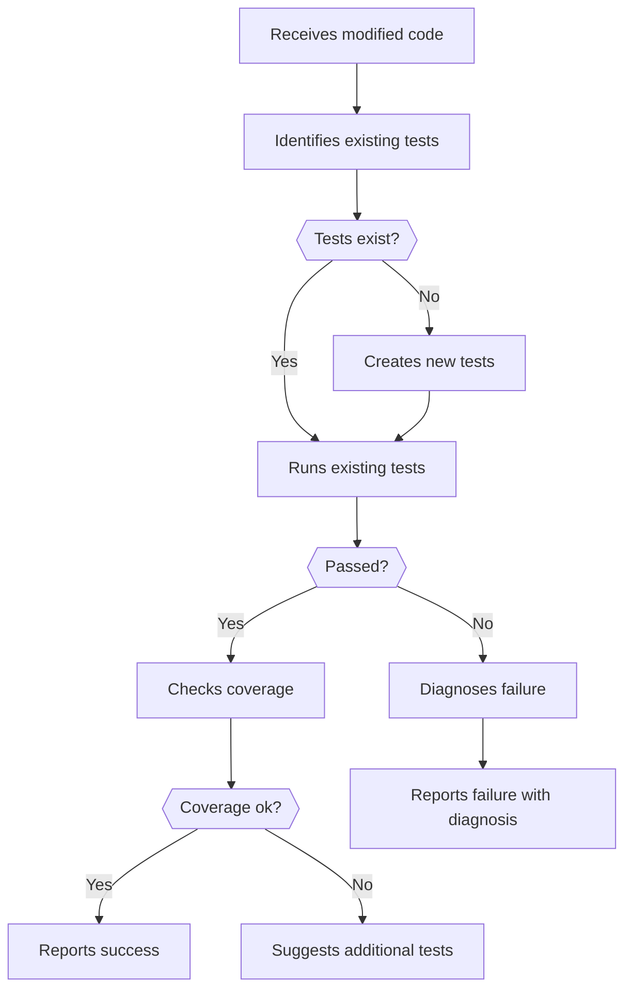

### Expected Output

```typescript
interface TestResult {
  command: string;
  passed: boolean;
  total: number;
  passed_count: number;
  failed_count: number;
  skipped_count: number;
  coverage?: CoverageReport;
  failures?: TestFailure[];
  duration_ms: number;
}

interface TestFailure {
  test: string;
  file: string;
  error: string;
  stack?: string;
  diagnosis?: string;
}

interface CoverageReport {
  lines: number;
  branches: number;
  functions: number;
  statements: number;
}
```

---

## Docs Agent

Agent specialized in documentation.

### Responsibilities

| Function | Description |
|----------|-------------|
| Generation | Creates documentation for new code |
| Updates | Updates docs when code changes |
| README | Keeps README.md updated |
| API Docs | Generates API documentation |
| ADRs | Creates Architecture Decision Records |

### Tools

| Tool | Permission | Usage |
|------|------------|-------|
| Read | Read | Read code and existing docs |
| Write | Write | Create new documentation files |
| Edit | Write | Edit existing documentation |
| Glob | Read | Find doc files |
| WebFetch | Read | Search external references |

### Restrictions

- **Documentation only**: does not modify source code
- **Conciseness**: documentation must be useful, not verbose
- **Consistency**: follows existing project style

### Documentation Types

| Type | When to Use | Format |
|------|-------------|--------|
| Inline comments | Complex, non-obvious logic | Comments in code |
| JSDoc/TSDoc | Public APIs | Annotations in functions/classes |
| README | Project/module overview | Markdown |
| ADR | Important architectural decisions | ADR template |
| API Docs | Endpoints and contracts | OpenAPI/Markdown |
| Runbooks | Operational procedures | Markdown with checklists |

### Expected Output

```typescript
interface DocsResult {
  filesCreated: string[];
  filesUpdated: string[];
  summary: string;
  wordCount: number;
}
```

---

## QA Agent (Quality Assurance)

Agent specialized in general quality control.

### Responsibilities

| Function | Description |
|----------|-------------|
| Verification | Verifies if delivery meets acceptance criteria |
| Integration | Validates that changes work together |
| Regression | Verifies nothing broke |
| Compliance | Verifies adherence to standards and conventions |
| Sign-off | Approves or rejects deliveries |

### Tools

| Tool | Permission | Usage |
|------|------------|-------|
| Read | Read | Read code and configurations |
| Bash | Execute | Run builds, lint, type-check |
| Glob | Read | Find relevant files |
| Grep | Read | Search patterns |
| GitDiff | Read | Analyze changes |

### Restrictions

- **Does not modify**: only validates and reports
- **Objective**: based on clear criteria, not opinion
- **Blocking**: can reject deliveries that don't pass criteria

### Quality Checklist

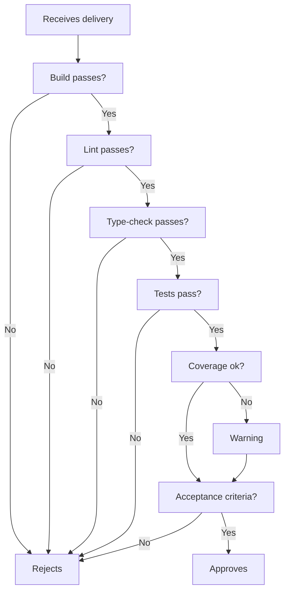

### Expected Output

```typescript
interface QAResult {
  checks: QACheck[];
  passed: boolean;
  blockers: string[];
  warnings: string[];
  summary: string;
}

interface QACheck {
  name: string;
  command?: string;
  passed: boolean;
  output?: string;
  required: boolean;
}
```

---

## Init Agent (VALARMIND.md)

Agent specialized in generating and maintaining the `VALARMIND.md` file, the project context document.

### Responsibilities

| Function | Description |
|----------|-------------|
| Signal Collection | Analyzes manifests, configs, docs, and project code |
| Stack Extraction | Identifies frameworks, languages, and versions |
| Architecture Mapping | Infers architectural patterns and layers |
| Practices Documentation | Extracts code, test, and git conventions |
| TREE Generation | Creates optimized directory structure |
| Token Optimization | Compacts content to fit limit (2500-3600 tokens) |
| Incremental Revision | Updates only sections that changed |

### Tools

| Tool | Permission | Usage |
|------|------------|-------|
| Read | Read | Read manifests, configs, code, and docs |
| Glob | Read | Find files by pattern |
| Grep | Read | Search patterns in files |
| TreeView | Read | Generate directory structure |

Note: The Init Agent does **not** write VALARMIND.md directly. It returns the generated content as text output, and the `/init` slash command handler writes it to disk. This separation keeps the agent focused on analysis and generation.

### Context Isolation

The Init Agent sets `excludeProjectContext = true`, meaning it does **not** receive the existing VALARMIND.md content in its prompt. This prevents circular reference — the agent generates fresh content based on project analysis, not biased by potentially outdated context.

After `/init` writes the new file, `contextLoader.invalidate()` is called to clear the session cache, ensuring subsequent agent calls see the updated content.

### Restrictions

- **Read-only tools**: only reads files and generates content as text output
- **No project context**: does not receive VALARMIND.md in prompt (avoids circular reference)
- **Token limit**: target 2500-3600, hard cap 4800
- **Conciseness**: prioritizes operational information, avoids verbosity

### Generation Workflow

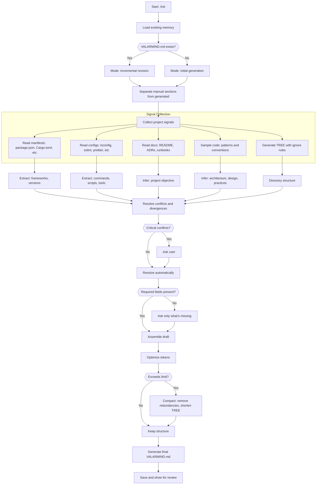

### VALARMIND.md Sections

| Section | Source | Required |
|---------|--------|----------|
| Objective | README, docs, inference | Yes |
| Stack (Core) | package.json, Cargo.toml, go.mod | Yes |
| Main Dependencies | lockfiles, manifests | Yes |
| Architecture | Structure and code analysis | Yes |
| Design (Patterns) | Code analysis | Yes |
| Practices (Code, Tests, Git) | Configs, analysis | Yes |
| Commands | package.json scripts, Makefile | Yes |
| Endpoints | Routes, controllers, OpenAPI | If applicable |
| Project Core | Core module analysis | Yes |
| Sensitive Points | Security analysis | Yes |
| Environment Variables | .env.example, docs | If applicable |
| External Integrations | Configs, docs | If applicable |
| Troubleshooting | Docs, runbooks | Optional |
| Snippets | Core code | Optional |
| TREE | Directory structure | Yes |
| References | Links to docs | Yes |

### Token Optimization Strategy

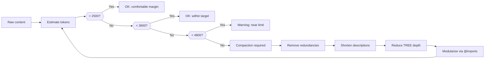

### Compaction Techniques

| Technique | Savings | When to Use |
|-----------|---------|-------------|
| Tabular format | 20-30% | Always prefer tables over lists |
| Remove patch versions | 5-10% | Keep only major.minor |
| Shallow TREE (depth 2-3) | 15-25% | Large projects |
| Ignore build/deps | 10-20% | Always |
| Abbreviate descriptions | 10-15% | When verbose |
| @imports for docs | 20-40% | Large, stable content |

### Expected Output

```typescript
interface InitResult {
  mode: 'create' | 'update';
  path: string;
  sections: SectionResult[];
  tokenCount: number;
  tokenBudget: { target: number; hardCap: number };
  warnings: string[];
  questionsAsked: number;
  changesFromPrevious?: string[];
}

interface SectionResult {
  name: string;
  source: 'inferred' | 'extracted' | 'manual' | 'asked';
  confidence: number;
  tokenCount: number;
}
```

### Integration with Other Agents

| Agent | Integration |
|-------|-------------|
| Search Agent | Provides codebase context for signal collection |
| Research Agent | Searches lib docs to describe stack |
| Orchestrator | Invokes Init Agent on /init command |

### Invocation Example

```typescript
// Orchestrator detects /init command
const initResult = await agentSpawn('init', {
  mode: existsSync('VALARMIND.md') ? 'update' : 'create',
  tokenBudget: { target: 3000, hardCap: 4800 },
  preserveManualSections: true,
});
```

---

## Inter-Agent Communication

### Message Protocol

Agents communicate through structured messages:

```typescript
interface AgentMessage {
  from: AgentType;
  to: AgentType;
  type: 'request' | 'response' | 'event';
  taskId: string;
  payload: unknown;
  timestamp: string;
}

type AgentType =
  | 'orchestrator'
  | 'search'
  | 'research'
  | 'code'
  | 'review'
  | 'test'
  | 'docs'
  | 'qa'
  | 'init';
```

### Typical Task Flow

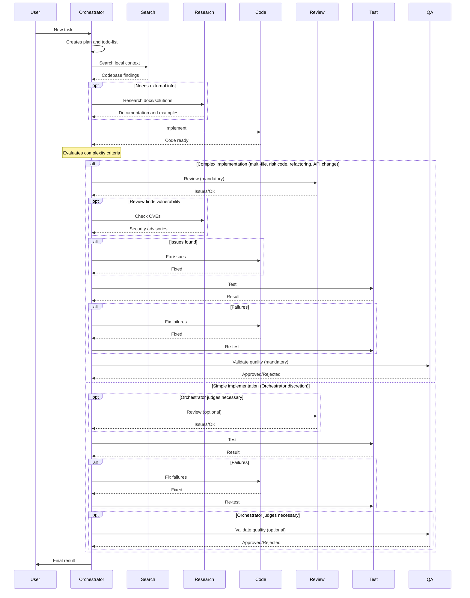

---

## Prompt Construction

Each agent's prompt is assembled by the `AgentRunner` via `PromptBuilder`:

```
PromptBuilder:
  Section "System" (priority 100) ← agent.buildSystemPrompt(context)
  Section "Project Context" (priority 80) ← context.projectContext (VALARMIND.md + local.md + state)
  └── Skipped if agent.excludeProjectContext === true
```

| Agent | buildSystemPrompt returns | excludeProjectContext |
|-------|---------------------------|----------------------|
| Search, Test, Docs, QA | Base system prompt only | false (default) |
| Code, Review | Base system prompt + conventions from workingState | false (default) |
| Init | Base system prompt only | **true** (avoids circular reference) |

The Orchestrator builds its own prompt directly (not via PromptBuilder), including `valarmindMd`, `localMd`, and `stateCompact`.

---

## Agent Configuration

### Tool Limits per Agent

```typescript
const agentToolLimits: Record<AgentType, ToolPermissions> = {
  orchestrator: {
    read: true,
    write: false,
    execute: false,
    spawn: true,
  },
  search: {
    read: true,
    write: false,
    execute: false,
    spawn: false,
    web: false,
  },
  research: {
    read: true,
    write: false,
    execute: false,
    spawn: false,
    web: true, // WebSearch, WebFetch, MCP
  },
  code: {
    read: true,
    write: true,
    execute: false,
    spawn: false,
  },
  review: {
    read: true,
    write: false,
    execute: false,
    spawn: false,
  },
  test: {
    read: true,
    write: true, // only test files
    execute: true, // only test commands
    spawn: false,
  },
  docs: {
    read: true,
    write: true, // only doc files
    execute: false,
    spawn: false,
  },
  qa: {
    read: true,
    write: false,
    execute: true, // build, lint, type-check
    spawn: false,
  },
  init: {
    read: true,
    write: false, // returns content as text; /init handler writes the file
    execute: false,
    spawn: false,
    web: false,
  },
};
```

### Timeout per Agent

| Agent | Default Timeout | Maximum |
|-------|-----------------|---------|
| Search | 30s | 60s |
| Research | 45s | 120s |
| Code | 120s | 300s |
| Review | 60s | 120s |
| Test | 180s | 600s |
| Docs | 60s | 120s |
| QA | 120s | 300s |
| Init | 90s | 180s |

---

## Integration with the Agentic Loop

Reference to flow in `docs/general.md`:

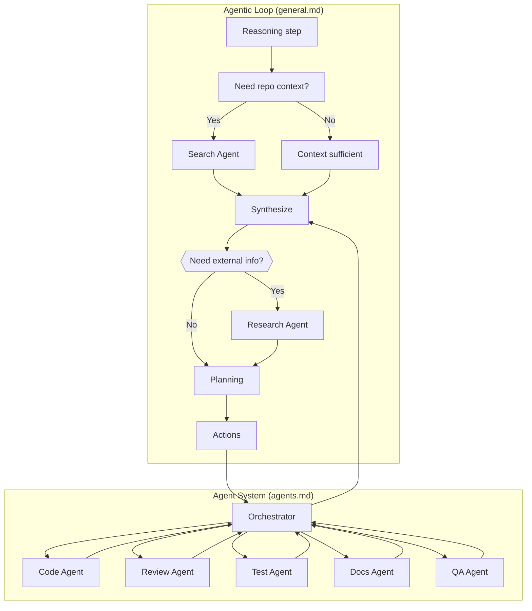

The Orchestrator acts as a bridge between the main agentic loop and specialist agents. The Research Agent is invoked when external information is needed (documentation, CVEs, best practices).

---

## Implementation Roadmap

### Phase 1: Foundation

- [x] Define TypeScript interfaces for all agents
- [x] Implement inter-agent communication protocol
- [x] Create basic Orchestrator with todo-list

### Phase 2: Core Agents

- [x] Implement Search Agent (based on existing Explore)
- [x] Implement Research Agent (WebSearch, WebFetch, MCP)
- [x] Implement Init Agent (VALARMIND.md generation)
- [x] Implement Code Agent
- [x] Implement Test Agent

### Phase 3: Quality Agents

- [x] Implement Review Agent (code review, security, performance, auto-fix loop)
- [x] Implement QA Agent (build, lint, typecheck, tests)
- [x] Implement Docs Agent (documentation generation/maintenance)
- [x] Quality gates in Orchestrator (review → auto-fix → re-review → QA)

### Phase 4: Integration

- [x] Integrate agents with main agentic loop (PromptBuilder, hooks, streaming, plan mode)
- [x] Implement monitoring and metrics (MetricsCollector via EventBus)
- [x] Integration tests (orchestrator flow, plan mode, hooks)

### Phase 5: Web Search, Plugins & Deferred

- [x] Web search via OpenRouter `:online` suffix for Research Agent
- [x] Web fetch with Turndown HTML→Markdown + 15min cache
- [x] Tree-sitter repo map for structural code understanding (30+ languages via WASM)
- [x] MCP Manager (stdio/StreamableHTTP transport, `mcp__server__tool` namespace)
- [x] Plugin Manager (HookPlugin, AgentPlugin, ProviderPlugin)
- [x] Security sandboxing (per-agent profiles, macOS sandbox-exec, Linux bubblewrap)

### Future (not planned)

- LSP integration via MCP (Serena pattern — user installs language-specific MCP servers)
- Tree-sitter Aider-style repo map with PageRank ranking
