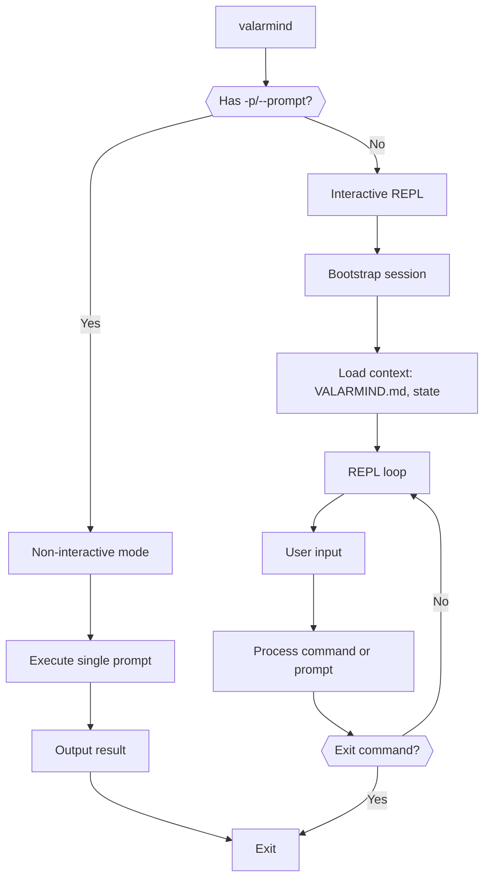
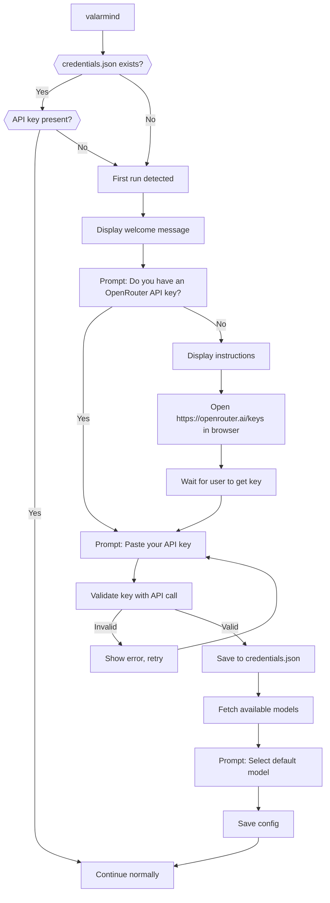
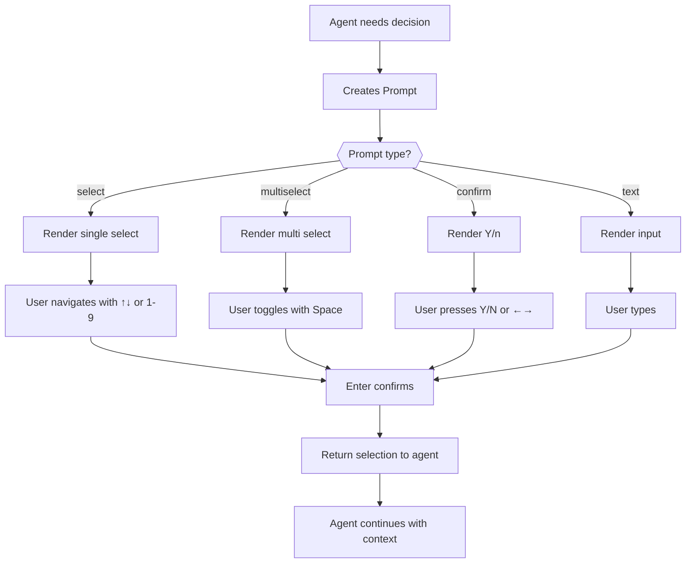
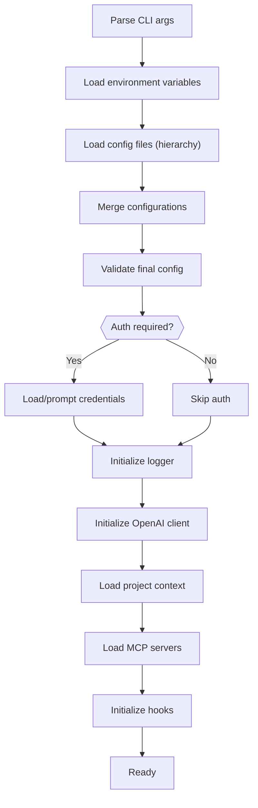

# CLI Architecture

This document defines the command-line interface for ValarMind, including commands, options, configuration, and interaction modes.

## Overview

ValarMind CLI provides two interaction modes: interactive REPL and non-interactive execution. Built with Commander.js for argument parsing and Bun as runtime.



## Installation

```bash
# Global install
bun install -g valarmind

# Or run directly
bunx valarmind
```

## Commands

### Main Command

```bash
valarmind [options] [prompt]
```

Starts ValarMind in the current directory. If a prompt is provided inline or via `-p`, runs in non-interactive mode.

### Subcommands

| Command | Description | Alias |
|---------|-------------|-------|
| `valarmind init` | Generate VALARMIND.md | - |
| `valarmind config` | Manage configuration | - |
| `valarmind auth` | Authenticate with OpenRouter | - |
| `valarmind doctor` | Diagnose environment issues | - |

## Authentication

ValarMind uses [OpenRouter](https://openrouter.ai/) as the API provider, giving access to multiple models (OpenAI, Anthropic, Google, etc.) with a single API key.

### First Run Flow



### Credential Storage

```
~/.config/valarmind/
├── credentials.json     # API keys (chmod 600)
└── config.json          # User preferences
```

**credentials.json** (permission `600` - owner read/write only):

```json
{
  "openrouter": {
    "api_key": "sk-or-v1-xxxxxxxxxxxx",
    "created_at": "2026-02-02T10:30:00Z",
    "validated_at": "2026-02-02T10:30:05Z"
  }
}
```

### Auth Command

```bash
# Interactive setup (same as first run)
valarmind auth

# Set key directly (skips interactive)
valarmind auth --key sk-or-v1-xxxxxxxxxxxx

# Remove stored credentials
valarmind auth --logout

# Show current auth status
valarmind auth --status

# Revalidate existing key
valarmind auth --validate
```

### Auth Command Options

| Option | Description |
|--------|-------------|
| `--key <key>` | Set API key directly (non-interactive) |
| `--logout` | Remove stored credentials |
| `--status` | Show authentication status |
| `--validate` | Validate stored API key |
| `--provider <name>` | Provider name (default: `openrouter`) |

### Environment Variable Override

The API key can also be set via environment variable, which takes precedence over stored credentials:

```bash
export VALARMIND_API_KEY=sk-or-v1-xxxxxxxxxxxx
valarmind -p "Hello"
```

Priority order:
1. `--key` flag (if provided)
2. `VALARMIND_API_KEY` environment variable
3. `~/.config/valarmind/credentials.json`

### API Key Validation

Before saving, the key is validated with a lightweight API call:

```typescript
// src/cli/auth.ts
async function validateApiKey(apiKey: string): Promise<ValidationResult> {
  try {
    const response = await fetch('https://openrouter.ai/api/v1/models', {
      headers: {
        'Authorization': `Bearer ${apiKey}`,
      },
    });

    if (response.status === 401) {
      return { valid: false, error: 'Invalid API key' };
    }

    if (!response.ok) {
      return { valid: false, error: `API error: ${response.status}` };
    }

    const data = await response.json();
    return {
      valid: true,
      models: data.data.map((m: any) => m.id),
    };
  } catch (error) {
    return { valid: false, error: 'Network error' };
  }
}
```

### First Run UI Example

```
┌─────────────────────────────────────────────────────────┐
│                                                         │
│   Welcome to ValarMind!                                 │
│                                                         │
│   ValarMind uses OpenRouter to access AI models.        │
│   You'll need an API key to continue.                   │
│                                                         │
└─────────────────────────────────────────────────────────┘

? Do you have an OpenRouter API key?

  ❯ 1. Yes, I have a key
    2. No, I need to create one

  ↑↓ navigate • enter confirm
```

If user selects "No":

```
┌─────────────────────────────────────────────────────────┐
│                                                         │
│   To get an API key:                                    │
│                                                         │
│   1. Go to https://openrouter.ai/keys                   │
│   2. Sign up or log in                                  │
│   3. Click "Create Key"                                 │
│   4. Copy the key (starts with sk-or-v1-)               │
│                                                         │
└─────────────────────────────────────────────────────────┘

Opening browser... (press Enter when ready)
```

Key input:

```
? Paste your OpenRouter API key:
  › sk-or-v1-████████████████████████████████

  ⠋ Validating...

✓ API key valid! Found 150+ available models.
```

Model selection:

```
? Select your default model:

  ❯ 1. anthropic/claude-3.5-sonnet (Recommended)
    2. openai/gpt-4o
    3. google/gemini-pro
    4. anthropic/claude-3-opus

  ↑↓ navigate • enter confirm
```

Success:

```
✓ Configuration saved!

  API Key:  sk-or-v1-****xxxx (stored in ~/.config/valarmind/credentials.json)
  Model:    anthropic/claude-3.5-sonnet

  Run 'valarmind' to start, or 'valarmind --help' for options.
```

### Implementation

```typescript
// src/cli/auth.ts
import { select, confirm, password } from './prompts';
import { writeFile, mkdir, chmod } from 'fs/promises';
import { homedir } from 'os';
import { join } from 'path';
import open from 'open';

const CONFIG_DIR = join(homedir(), '.config', 'valarmind');
const CREDENTIALS_FILE = join(CONFIG_DIR, 'credentials.json');

interface Credentials {
  openrouter: {
    api_key: string;
    created_at: string;
    validated_at: string;
  };
}

export async function runAuth(options: AuthOptions): Promise<void> {
  // Handle flags
  if (options.status) {
    return showStatus();
  }
  if (options.logout) {
    return logout();
  }
  if (options.validate) {
    return revalidate();
  }
  if (options.key) {
    return setKeyDirect(options.key);
  }

  // Interactive flow
  await interactiveAuth();
}

async function interactiveAuth(): Promise<void> {
  console.log(welcomeBox());

  const hasKey = await select({
    type: 'select',
    message: 'Do you have an OpenRouter API key?',
    options: [
      { label: 'Yes, I have a key', value: 'yes' },
      { label: 'No, I need to create one', value: 'no' },
    ],
  });

  if (hasKey === 'no') {
    console.log(instructionsBox());
    await open('https://openrouter.ai/keys');
    await confirm({
      type: 'confirm',
      message: 'Press Enter when ready...',
      default: true,
    });
  }

  let apiKey: string | null = null;
  let validationResult: ValidationResult;

  // Retry loop for invalid keys
  while (true) {
    apiKey = await password({
      type: 'password',
      message: 'Paste your OpenRouter API key:',
      validate: (v) => v.startsWith('sk-or-') || 'Key should start with sk-or-',
    });

    if (!apiKey) {
      console.log('Cancelled.');
      process.exit(1);
    }

    console.log('  ⠋ Validating...');
    validationResult = await validateApiKey(apiKey);

    if (validationResult.valid) {
      console.log(`\n✓ API key valid! Found ${validationResult.models?.length}+ available models.\n`);
      break;
    } else {
      console.log(`\n✗ ${validationResult.error}. Please try again.\n`);
    }
  }

  // Model selection
  const popularModels = [
    { label: 'anthropic/claude-3.5-sonnet', value: 'anthropic/claude-3.5-sonnet', hint: '(Recommended)' },
    { label: 'openai/gpt-4o', value: 'openai/gpt-4o' },
    { label: 'google/gemini-pro', value: 'google/gemini-pro' },
    { label: 'anthropic/claude-3-opus', value: 'anthropic/claude-3-opus' },
  ];

  const model = await select({
    type: 'select',
    message: 'Select your default model:',
    options: popularModels,
    default: 0,
  });

  // Save credentials
  await mkdir(CONFIG_DIR, { recursive: true });

  const credentials: Credentials = {
    openrouter: {
      api_key: apiKey,
      created_at: new Date().toISOString(),
      validated_at: new Date().toISOString(),
    },
  };

  await writeFile(CREDENTIALS_FILE, JSON.stringify(credentials, null, 2));
  await chmod(CREDENTIALS_FILE, 0o600);

  // Save config
  const configFile = join(CONFIG_DIR, 'config.json');
  const config = { model };
  await writeFile(configFile, JSON.stringify(config, null, 2));

  console.log(successBox(apiKey, model));
}

export async function checkFirstRun(): Promise<boolean> {
  try {
    const creds = await loadCredentials();
    return !creds?.openrouter?.api_key;
  } catch {
    return true;
  }
}

export async function loadCredentials(): Promise<Credentials | null> {
  try {
    const content = await Bun.file(CREDENTIALS_FILE).text();
    return JSON.parse(content);
  } catch {
    return null;
  }
}

export async function getApiKey(): Promise<string | null> {
  // Priority: env > file
  if (process.env.VALARMIND_API_KEY) {
    return process.env.VALARMIND_API_KEY;
  }

  const creds = await loadCredentials();
  return creds?.openrouter?.api_key ?? null;
}
```

### Security Notes

| Aspect | Implementation |
|--------|----------------|
| File permissions | `chmod 600` on credentials.json |
| Display masking | Key shown as `sk-or-v1-****xxxx` |
| Memory | Key not logged, cleared after use |
| Validation | Key validated before storage |
| Override | Env var takes precedence (for CI/CD) |

## Options

### Global Options

| Option | Short | Type | Default | Description |
|--------|-------|------|---------|-------------|
| `--prompt` | `-p` | string | - | Execute single prompt and exit |
| `--model` | `-m` | string | `gpt-4.1` | Model to use |
| `--config` | `-c` | string | - | Path to config file |
| `--verbose` | `-v` | boolean | false | Verbose output |
| `--quiet` | `-q` | boolean | false | Minimal output |
| `--version` | `-V` | - | - | Show version |
| `--help` | `-h` | - | - | Show help |

### Execution Options

| Option | Short | Type | Default | Description |
|--------|-------|------|---------|-------------|
| `--yes` | `-y` | boolean | false | Auto-approve all permission requests |
| `--plan` | - | boolean | false | Plan mode: propose actions without executing |
| `--sandbox` | - | boolean | true | Run commands in sandbox |
| `--no-sandbox` | - | boolean | - | Disable sandbox (requires --yes or prompts) |
| `--timeout` | `-t` | number | 300 | Max execution time in seconds |
| `--max-turns` | - | number | 100 | Max agentic loop iterations |

### Context Options

| Option | Type | Default | Description |
|--------|------|---------|-------------|
| `--context` | string | - | Additional context file to include |
| `--no-valarmind` | boolean | - | Skip loading VALARMIND.md |
| `--no-state` | boolean | - | Skip loading .valarmind/memory/state |
| `--token-budget` | number | 4800 | Max tokens for context |

### Output Options

| Option | Type | Default | Description |
|--------|------|---------|-------------|
| `--output` | string | - | Write result to file |
| `--format` | string | `text` | Output format: text, json, markdown |
| `--no-color` | boolean | - | Disable colored output |
| `--log-file` | string | - | Write logs to file |
| `--log-level` | string | `info` | Log level: debug, info, warn, error |

## Slash Commands (REPL)

Interactive commands available during REPL session:

| Command | Arguments | Description |
|---------|-----------|-------------|
| `/init` | `[--force]` | Generate or update VALARMIND.md |
| `/compact` | - | Compact context to save tokens |
| `/clear` | - | Clear screen and conversation history |
| `/help` | `[topic]` | Show help |
| `/exit` | - | Exit REPL |
| `/status` | - | Show session status (tokens, turns, agents) |
| `/model` | `[alias\|id\|list]` | Switch model (interactive or direct) |
| `/settings` | `[key]` | Edit settings (model, key, temperature, etc.) |
| `/plan` | `[on\|off]` | Toggle plan mode |
| `/approve` | - | Approve pending plan |
| `/reject` | `[reason]` | Reject pending plan |
| `/undo` | - | Undo last file change |
| `/diff` | - | Show pending changes |
| `/commit` | `[message]` | Commit current changes |
| `/agents` | - | List active agents and status |
| `/tasks` | - | Show todo-list |

## Configuration

### Configuration Files

```
~/.config/valarmind/
├── config.json          # Global user config
├── credentials.json     # API keys (encrypted)
└── models.json          # Model aliases and defaults

<project>/
├── VALARMIND.md         # Project instructions (versioned)
├── VALARMIND.local.md   # Local preferences (gitignored)
└── .valarmind/
    ├── config.json      # Project-specific config
    └── memory/
        └── state.json   # Operational state
```

### Configuration Hierarchy

Priority (highest to lowest):
1. Command-line arguments
2. Environment variables
3. Project config (`.valarmind/config.json`)
4. User config (`~/.config/valarmind/config.json`)
5. Defaults

### config.json Schema

```typescript
interface Config {
  // Model settings
  model: string;
  fallbackModel?: string;
  temperature?: number;
  maxTokens?: number;

  // Execution settings
  sandbox: boolean;
  autoApprove: boolean;
  planMode: boolean;
  maxTurns: number;
  timeout: number;

  // Context settings
  tokenBudget: {
    target: number;  // 2500-3600
    hardCap: number; // 4800
  };

  // Logging
  logLevel: 'debug' | 'info' | 'warn' | 'error';
  logFile?: string;

  // Hooks
  hooks?: HookConfig;

  // MCP servers
  mcp?: MCPConfig[];

  // Permission allowlists/denylists
  permissions?: PermissionConfig;
}
```

### Environment Variables

| Variable | Description | Default |
|----------|-------------|---------|
| `VALARMIND_API_KEY` | OpenAI API key | - |
| `VALARMIND_MODEL` | Default model | `gpt-4.1` |
| `VALARMIND_CONFIG` | Config file path | - |
| `VALARMIND_LOG_LEVEL` | Log level | `info` |
| `VALARMIND_SANDBOX` | Enable sandbox | `true` |
| `VALARMIND_NO_COLOR` | Disable colors | `false` |
| `VALARMIND_TOKEN_BUDGET` | Token budget | `4800` |

## REPL Input

The REPL uses a custom raw-mode input prompt with inline slash command suggestions and multi-line support.

### Multi-line Input

| Shortcut | Action |
|----------|--------|
| `Alt+Enter` | Insert newline (works in all terminals) |
| `Shift+Enter` | Insert newline (requires terminal modifier support) |
| `Enter` | Submit input |

When in multi-line mode, `Up`/`Down` arrows navigate between lines. In single-line mode, they navigate slash command suggestions.

### Input Keyboard Shortcuts

| Key | Action |
|-----|--------|
| `Enter` | Submit input |
| `Alt+Enter` / `Shift+Enter` | Insert newline |
| `Tab` | Autocomplete slash command |
| `Up` / `Down` | Navigate suggestions (single-line) or lines (multi-line) |
| `Left` / `Right` | Move cursor |
| `Home` / `Ctrl+A` | Go to start of current line |
| `End` / `Ctrl+E` | Go to end of current line |
| `Ctrl+U` | Clear entire input |
| `Ctrl+W` | Delete previous word |
| `Escape` | Clear input (or exit if empty) |
| `Ctrl+C` | Exit |

### Slash Command Suggestions

Type `/` to see available commands. Use arrow keys to navigate and `Tab` to autocomplete. Suggestions only appear in single-line mode.

## Interactive Prompts

When agents need user input for decisions, the CLI presents interactive prompts with keyboard navigation.

### Prompt Types

| Type | Usage | Navigation |
|------|-------|------------|
| `select` | Single choice from options | `↑↓` navigate, `Enter` confirm |
| `multiselect` | Multiple choices | `↑↓` navigate, `Space` toggle, `Enter` confirm |
| `confirm` | Yes/No question | `←→` or `y/n`, `Enter` confirm |
| `text` | Free text input | Type, `Enter` confirm |
| `password` | Hidden text input | Type, `Enter` confirm |

### Select (Single Choice)

```
? Which authentication method should we use?

  ❯ 1. JWT tokens (Recommended)
    2. Session cookies
    3. OAuth 2.0
    4. API keys

  ↑↓ navigate • enter confirm • esc cancel
```

User can press `1`, `2`, `3`, `4` to jump directly or use arrows.

### Multi-Select (Multiple Choice)

```
? Which features do you want to enable?

  ◉ 1. User authentication
  ◯ 2. Rate limiting
  ◉ 3. Request logging
  ◯ 4. CORS support

  ↑↓ navigate • space toggle • a toggle all • enter confirm
```

### Confirm

```
? Do you want to proceed with these changes? (Y/n)
```

### Interface Definitions

```typescript
interface SelectPrompt {
  type: 'select';
  message: string;
  options: SelectOption[];
  default?: number;  // index
}

interface SelectOption {
  label: string;
  value: string;
  description?: string;
  hint?: string;  // e.g., "(Recommended)"
}

interface MultiSelectPrompt {
  type: 'multiselect';
  message: string;
  options: SelectOption[];
  default?: number[];  // selected indices
  min?: number;        // minimum selections
  max?: number;        // maximum selections
  required?: boolean;
}

interface ConfirmPrompt {
  type: 'confirm';
  message: string;
  default?: boolean;
}

interface TextPrompt {
  type: 'text';
  message: string;
  default?: string;
  placeholder?: string;
  validate?: (value: string) => string | true;  // error message or true
}

type Prompt = SelectPrompt | MultiSelectPrompt | ConfirmPrompt | TextPrompt;
```

### Agent Question Flow



### Keyboard Shortcuts

| Key | Action | Context |
|-----|--------|---------|
| `↑` / `k` | Move up | select, multiselect |
| `↓` / `j` | Move down | select, multiselect |
| `1-9` | Jump to option | select, multiselect |
| `Space` | Toggle selection | multiselect |
| `a` | Toggle all | multiselect |
| `Enter` | Confirm | all |
| `Esc` | Cancel | all |
| `y` | Yes | confirm |
| `n` | No | confirm |
| `←` / `→` | Switch yes/no | confirm |

### Implementation Example

```typescript
// src/cli/prompts.ts
import * as readline from 'readline';

interface PromptState {
  cursor: number;
  selected: Set<number>;  // for multiselect
}

export async function select<T extends string>(
  prompt: SelectPrompt
): Promise<T | null> {
  const state: PromptState = {
    cursor: prompt.default ?? 0,
    selected: new Set(),
  };

  return new Promise((resolve) => {
    const render = () => {
      console.clear();
      console.log(`? ${prompt.message}\n`);

      prompt.options.forEach((opt, i) => {
        const prefix = i === state.cursor ? '❯' : ' ';
        const num = i + 1;
        const hint = opt.hint ? ` ${opt.hint}` : '';
        console.log(`  ${prefix} ${num}. ${opt.label}${hint}`);
        if (opt.description && i === state.cursor) {
          console.log(`      ${opt.description}`);
        }
      });

      console.log('\n  ↑↓ navigate • enter confirm • esc cancel');
    };

    readline.emitKeypressEvents(process.stdin);
    process.stdin.setRawMode(true);

    const handler = (str: string, key: readline.Key) => {
      if (key.name === 'up' || key.name === 'k') {
        state.cursor = Math.max(0, state.cursor - 1);
        render();
      } else if (key.name === 'down' || key.name === 'j') {
        state.cursor = Math.min(prompt.options.length - 1, state.cursor + 1);
        render();
      } else if (str >= '1' && str <= '9') {
        const idx = parseInt(str) - 1;
        if (idx < prompt.options.length) {
          state.cursor = idx;
          render();
        }
      } else if (key.name === 'return') {
        cleanup();
        resolve(prompt.options[state.cursor].value as T);
      } else if (key.name === 'escape') {
        cleanup();
        resolve(null);
      }
    };

    const cleanup = () => {
      process.stdin.removeListener('keypress', handler);
      process.stdin.setRawMode(false);
    };

    process.stdin.on('keypress', handler);
    render();
  });
}

export async function multiselect<T extends string>(
  prompt: MultiSelectPrompt
): Promise<T[] | null> {
  const state: PromptState = {
    cursor: 0,
    selected: new Set(prompt.default ?? []),
  };

  return new Promise((resolve) => {
    const render = () => {
      console.clear();
      console.log(`? ${prompt.message}\n`);

      prompt.options.forEach((opt, i) => {
        const cursor = i === state.cursor ? '❯' : ' ';
        const check = state.selected.has(i) ? '◉' : '◯';
        const num = i + 1;
        console.log(`  ${cursor} ${check} ${num}. ${opt.label}`);
      });

      console.log('\n  ↑↓ navigate • space toggle • a toggle all • enter confirm');
    };

    readline.emitKeypressEvents(process.stdin);
    process.stdin.setRawMode(true);

    const handler = (str: string, key: readline.Key) => {
      if (key.name === 'up' || key.name === 'k') {
        state.cursor = Math.max(0, state.cursor - 1);
        render();
      } else if (key.name === 'down' || key.name === 'j') {
        state.cursor = Math.min(prompt.options.length - 1, state.cursor + 1);
        render();
      } else if (str >= '1' && str <= '9') {
        const idx = parseInt(str) - 1;
        if (idx < prompt.options.length) {
          state.cursor = idx;
          render();
        }
      } else if (key.name === 'space') {
        if (state.selected.has(state.cursor)) {
          state.selected.delete(state.cursor);
        } else {
          state.selected.add(state.cursor);
        }
        render();
      } else if (str === 'a') {
        if (state.selected.size === prompt.options.length) {
          state.selected.clear();
        } else {
          prompt.options.forEach((_, i) => state.selected.add(i));
        }
        render();
      } else if (key.name === 'return') {
        if (prompt.min && state.selected.size < prompt.min) {
          return; // don't allow confirm if min not met
        }
        cleanup();
        const values = Array.from(state.selected).map(
          (i) => prompt.options[i].value as T
        );
        resolve(values);
      } else if (key.name === 'escape') {
        cleanup();
        resolve(null);
      }
    };

    const cleanup = () => {
      process.stdin.removeListener('keypress', handler);
      process.stdin.setRawMode(false);
    };

    process.stdin.on('keypress', handler);
    render();
  });
}
```

### Agent Usage Example

```typescript
// Agent asking user to choose
const authMethod = await select<'jwt' | 'session' | 'oauth'>({
  type: 'select',
  message: 'Which authentication method should we use?',
  options: [
    {
      label: 'JWT tokens',
      value: 'jwt',
      hint: '(Recommended)',
      description: 'Stateless, scalable, good for APIs',
    },
    {
      label: 'Session cookies',
      value: 'session',
      description: 'Traditional, requires session store',
    },
    {
      label: 'OAuth 2.0',
      value: 'oauth',
      description: 'Third-party auth (Google, GitHub)',
    },
  ],
  default: 0,
});

// Agent asking for multiple features
const features = await multiselect<'auth' | 'ratelimit' | 'logging' | 'cors'>({
  type: 'multiselect',
  message: 'Which features do you want to enable?',
  options: [
    { label: 'User authentication', value: 'auth' },
    { label: 'Rate limiting', value: 'ratelimit' },
    { label: 'Request logging', value: 'logging' },
    { label: 'CORS support', value: 'cors' },
  ],
  default: [0, 2],  // auth and logging pre-selected
  min: 1,
});
```

### Non-Interactive Mode

When running with `-p` or piped input, prompts use defaults or fail:

| Behavior | Flag | Description |
|----------|------|-------------|
| Use defaults | `--defaults` | Use default values for all prompts |
| Fail on prompt | `--no-input` | Exit with error if prompt needed |
| JSON input | `--answers <file>` | Pre-provide answers in JSON |

```bash
# Provide answers via JSON
valarmind -p "Setup auth" --answers answers.json

# answers.json
{
  "authMethod": "jwt",
  "features": ["auth", "logging"]
}
```

---

## Hooks

Hooks allow custom scripts to run at specific points in the execution flow.

### Hook Types

| Hook | Trigger | Can Block |
|------|---------|-----------|
| `UserPromptSubmit` | After user input, before processing | Yes |
| `PreToolUse` | Before any tool execution | Yes |
| `PostToolUse` | After tool execution | No |
| `PermissionRequest` | Before asking user for permission | Yes |
| `PreCompact` | Before context compaction | No |
| `SessionEnd` | Before session closes | No |

### Hook Configuration

```typescript
interface HookConfig {
  [hookName: string]: {
    command: string;
    timeout?: number;  // ms
    env?: Record<string, string>;
    onError?: 'ignore' | 'warn' | 'fail';
  };
}
```

### Hook Example

```json
{
  "hooks": {
    "UserPromptSubmit": {
      "command": "./scripts/validate-prompt.sh",
      "timeout": 5000,
      "onError": "warn"
    },
    "PreToolUse": {
      "command": "./scripts/audit-tool.sh",
      "env": { "LOG_PATH": "./logs/tools.log" }
    }
  }
}
```

### Hook Environment

Hooks receive context via environment variables:

| Variable | Description | Available In |
|----------|-------------|--------------|
| `VALARMIND_HOOK` | Hook name | All |
| `VALARMIND_SESSION_ID` | Session identifier | All |
| `VALARMIND_PROMPT` | User prompt | UserPromptSubmit |
| `VALARMIND_TOOL` | Tool being used | PreToolUse, PostToolUse |
| `VALARMIND_TOOL_ARGS` | Tool arguments (JSON) | PreToolUse, PostToolUse |
| `VALARMIND_TOOL_RESULT` | Tool result (JSON) | PostToolUse |
| `VALARMIND_PERMISSION` | Permission being requested | PermissionRequest |

## Permission System

### Permission Modes

| Mode | Description | Flag |
|------|-------------|------|
| `strict` | Ask for every operation | default |
| `permissive` | Auto-approve within allowlist | `--yes` with config |
| `yolo` | Auto-approve everything | `--yes` |

### Permission Configuration

```typescript
interface PermissionConfig {
  mode: 'strict' | 'permissive' | 'yolo';

  // Allowlist: auto-approve these
  allow?: {
    tools?: string[];           // ['Read', 'Glob', 'Grep']
    paths?: string[];           // ['src/**', 'tests/**']
    commands?: string[];        // ['bun test', 'bun lint']
  };

  // Denylist: always block these
  deny?: {
    tools?: string[];           // ['Bash']
    paths?: string[];           // ['.env*', 'secrets/**']
    commands?: string[];        // ['rm -rf', 'sudo *']
    patterns?: string[];        // ['password', 'secret', 'token']
  };
}
```

## MCP Server Configuration

```typescript
interface MCPConfig {
  name: string;
  command: string;
  args?: string[];
  env?: Record<string, string>;
  enabled?: boolean;
}
```

### Example

```json
{
  "mcp": [
    {
      "name": "better-auth",
      "command": "npx",
      "args": ["@anthropic/mcp-server-better-auth"],
      "enabled": true
    },
    {
      "name": "github",
      "command": "npx",
      "args": ["@anthropic/mcp-server-github"],
      "env": { "GITHUB_TOKEN": "${GITHUB_TOKEN}" }
    }
  ]
}
```

## CLI Implementation

### Entry Point Structure

```typescript
// src/cli/index.ts
import { Command } from 'commander';
import { version } from '../../package.json';

const program = new Command();

program
  .name('valarmind')
  .description('Multi-agent CLI for software development')
  .version(version)
  .option('-p, --prompt <text>', 'Execute single prompt')
  .option('-m, --model <name>', 'Model to use', 'gpt-4.1')
  .option('-c, --config <path>', 'Config file path')
  .option('-v, --verbose', 'Verbose output')
  .option('-q, --quiet', 'Minimal output')
  .option('-y, --yes', 'Auto-approve permissions')
  .option('--plan', 'Plan mode')
  .option('--sandbox', 'Enable sandbox', true)
  .option('--no-sandbox', 'Disable sandbox')
  .option('-t, --timeout <seconds>', 'Timeout', '300')
  .option('--max-turns <n>', 'Max loop iterations', '100')
  .option('--token-budget <n>', 'Token budget', '4800')
  .option('--output <path>', 'Output file')
  .option('--format <type>', 'Output format', 'text')
  .option('--log-level <level>', 'Log level', 'info')
  .action(async (options) => {
    await runMain(options);
  });

// Subcommands
program
  .command('init')
  .description('Generate VALARMIND.md')
  .option('--force', 'Overwrite existing file')
  .action(async (options) => {
    await runInit(options);
  });

program
  .command('config')
  .description('Manage configuration')
  .option('--get <key>', 'Get config value')
  .option('--set <key=value>', 'Set config value')
  .option('--list', 'List all config')
  .action(async (options) => {
    await runConfig(options);
  });

program
  .command('auth')
  .description('Authenticate with API provider')
  .option('--provider <name>', 'Provider name', 'openai')
  .action(async (options) => {
    await runAuth(options);
  });

program
  .command('doctor')
  .description('Diagnose environment issues')
  .action(async () => {
    await runDoctor();
  });

program.parse();
```

### Bootstrap Flow



### REPL Implementation

```typescript
// src/cli/repl.ts
import * as readline from 'readline';

interface REPLState {
  sessionId: string;
  turns: number;
  tokensUsed: number;
  planMode: boolean;
  pendingPlan?: Plan;
  history: Message[];
}

export async function startREPL(config: Config): Promise<void> {
  const state: REPLState = {
    sessionId: generateSessionId(),
    turns: 0,
    tokensUsed: 0,
    planMode: config.planMode,
    history: [],
  };

  const rl = readline.createInterface({
    input: process.stdin,
    output: process.stdout,
    prompt: '> ',
  });

  console.log(`ValarMind v${version}`);
  console.log(`Model: ${config.model} | Budget: ${config.tokenBudget.hardCap} tokens`);
  console.log('Type /help for commands\n');

  rl.prompt();

  rl.on('line', async (line) => {
    const input = line.trim();

    if (!input) {
      rl.prompt();
      return;
    }

    // Handle slash commands
    if (input.startsWith('/')) {
      const handled = await handleSlashCommand(input, state, config);
      if (handled === 'exit') {
        rl.close();
        return;
      }
      rl.prompt();
      return;
    }

    // Process as prompt
    await processPrompt(input, state, config);
    rl.prompt();
  });

  rl.on('close', async () => {
    await runHook('SessionEnd', { sessionId: state.sessionId });
    process.exit(0);
  });
}
```

## Exit Codes

| Code | Description |
|------|-------------|
| 0 | Success |
| 1 | General error |
| 2 | Invalid arguments |
| 3 | Configuration error |
| 4 | Authentication error |
| 5 | Timeout |
| 6 | Permission denied |
| 7 | Hook blocked execution |
| 8 | Model/API error |

## Usage Examples

### Basic Usage

```bash
# Interactive mode
valarmind

# Single prompt
valarmind -p "Add a logout button to the navbar"

# With specific model
valarmind -m gpt-4o -p "Refactor auth module"

# Plan mode (no execution)
valarmind --plan -p "Implement user settings page"

# Auto-approve in sandbox
valarmind -y --sandbox -p "Run tests and fix failures"

# Verbose with log file
valarmind -v --log-file ./debug.log
```

### Configuration Examples

```bash
# Generate VALARMIND.md
valarmind init

# Force regenerate
valarmind init --force

# Set default model
valarmind config --set model=gpt-4o

# List configuration
valarmind config --list

# Authenticate
valarmind auth --provider openai

# Check environment
valarmind doctor
```

### Pipeline Usage

```bash
# Pipe prompt from file
cat prompt.txt | valarmind

# Pipe to output
valarmind -p "Generate API docs" --format markdown > API.md

# Non-interactive CI usage
valarmind -y --no-sandbox -p "Run linter and fix issues" || exit 1
```

## Implementation Roadmap

### Phase 1: Foundation

- [x] Commander.js setup with all options
- [x] Config file loading and merging
- [x] Environment variable support
- [x] Logger initialization (Pino)
- [x] Exit codes

### Phase 2: Core Features

- [x] Interactive REPL with @clack/prompts
- [x] Slash command parser (16 commands: /init, /compact, /clear, /help, /exit, /status, /model, /settings, /agents, /plan, /approve, /reject, /tasks, /undo, /diff, /commit)
- [x] Multi-line input support (Alt+Enter / Shift+Enter)
- [x] Non-interactive mode (-p flag)
- [x] Hooks system (UserPromptSubmit, PreToolUse, PostToolUse, SessionEnd, PreCompact)
- [ ] Permission prompts (planned)

### Phase 3: Integration

- [x] OpenRouter API integration (LLMClient with chat + chatStream)
- [x] Context loading (VALARMIND.md, VALARMIND.local.md, state.json)
- [x] Token budget tracking (PromptBuilder with priority sections)
- [ ] MCP server management (Phase 5)
- [ ] Sandbox execution (Phase 5)

### Phase 4: Polish

- [x] Colored output (picocolors via ui.ts)
- [x] Progress indicators (clack spinners)
- [x] Error formatting
- [x] Doctor command (`valarmind doctor`)
- [x] /clear screen reset (clears console and reprints banner)
- [ ] Shell completions (planned)

## References

- [Commander.js](https://github.com/tj/commander.js)
- [Bun CLI](https://bun.sh/docs/cli/bun)
- @docs/general.md
- @docs/memory.md
- @docs/agents.md
