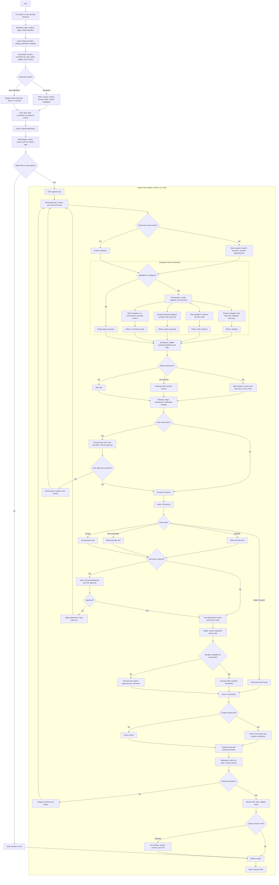

## General Workflow

## Workflow (mermaid)

```mermaid
flowchart TD
    A["User"] --> B["CLI launch in repo working directory"]
    B --> C["Bootstrap: auth, runtime, flags, model selection"]
    C --> D["Load config and policy: settings, allowlists, denylists"]
    D --> E["Load project context: CLAUDE.md, rules, skills, plugins, MCP, hooks"]
    E --> F{"Interaction mode?"}
    F -->|"Interactive"| G["REPL session: history, session state, context budgeting"]
    F -->|"Non interactive"| H["Single prompt execution: stdin or -p prompt"]
    G --> I["User input: task, constraints, acceptance criteria"]
    H --> I

    I --> J["Hook: UserPromptSubmit"]
    J --> K["Interpretation: intent, scope, success criteria, risks"]
    K --> L{"Need tools or repo actions?"}
    L -->|"No"| M["Direct answer in text"]
    L -->|"Yes"| N["Enter agentic loop"]

    subgraph LOOP["Agentic loop: gather context, act, verify"]
        N --> O["Reasoning step: choose next move and tools"]
        O --> P{"Need more repo context?"}
        P -->|"Yes"| Q["Repo analysis: search, read files, symbols, dependencies"]
        P -->|"No"| R["Context sufficient"]

        Q --> S{"Delegate to subagents?"}
        R --> S

        subgraph SA["Subagents and orchestration"]
            S -->|"Yes"| T["Orchestrator: create subtasks and tool limits"]
            S -->|"No"| U["Single agent execution"]

            T --> V["Explore subagent: fast read only codebase discovery"]
            T --> W["Plan subagent: research for plan mode"]
            T --> X["General purpose subagent: complex multi step work"]
            T --> Y["Bash subagent: run commands in separate context"]
            V --> Z["Return: findings"]
            W --> AA["Return: plan research"]
            X --> AB["Return: patch proposals"]
            Y --> AC["Return: command results"]
        end

        Z --> AD["Synthesize: update working hypothesis and plan"]
        AA --> AD
        AB --> AD
        AC --> AD
        U --> AD

        AD --> AE{"Need external info?"}
        AE -->|"Yes"| AF["Web research: search and fetch docs, errors, APIs"]
        AE -->|"Yes via MCP"| AG["External tools via MCP servers"]
        AE -->|"No"| AH["Skip web"]

        AF --> AI["Planning: steps, checkpoints, verification strategy"]
        AG --> AI
        AH --> AI

        AI --> AJ{"Plan mode active?"}
        AJ -->|"Yes"| AK["Propose plan only: read only tools, wait for approval"]
        AJ -->|"No"| AL["Proceed to actions"]

        AK --> AM{"User approves execution?"}
        AM -->|"No"| AN["Revise plan or gather more context"]
        AN --> O
        AM -->|"Yes"| AL

        AL --> AO["Hook: PreToolUse"]
        AO --> AP{"Action type?"}
        AP -->|"Read or search"| AQ["Read and search tools"]
        AP -->|"Edit files"| AR["Write and edit tools"]
        AP -->|"Run commands"| AS["Shell execution tool"]
        AP -->|"Git ops"| AT["Git operations tool"]

        AR --> AU{"Permission required?"}
        AS --> AU
        AT --> AU
        AU -->|"Yes"| AV["Hook: PermissionRequest and user approval"]
        AU -->|"No"| AW["Auto allowed by current permission mode"]

        AV --> AX{"Approved?"}
        AX -->|"No"| AY["Adjust approach or stay read only"]
        AY --> O
        AX -->|"Yes"| AW

        AW --> AZ["Safety: create checkpoint before edits"]
        AZ --> BA{"Sandbox available for commands?"}
        BA -->|"Yes"| BB["Execute within sandbox boundaries"]
        BA -->|"No"| BC["Execute with explicit approvals per command"]

        AQ --> BD["Hook: PostToolUse"]
        BB --> BD
        BC --> BD

        BD --> BE{"Context window full?"}
        BE -->|"Yes"| BF["Hook: PreCompact and context compaction"]
        BE -->|"No"| BG["Keep context"]

        BF --> BH["Continue loop with refreshed context"]
        BG --> BH
        BH --> BI["Verification: build, lint, tests, runtime checks"]
        BI --> BJ{"Passed verification?"}
        BJ -->|"No"| BK["Diagnose failures and iterate"]
        BK --> O
        BJ -->|"Yes"| BL["Review: diff, risks, rollback notes"]

        BL --> BM{"Create commit or PR?"}
        BM -->|"Optional"| BN["Git workflow: branch, commit, push, PR"]
        BM -->|"No"| BO["Deliver results"]

        BN --> BO
        BO --> BP["Hook: Session END"]
    end

    M --> BO
```
