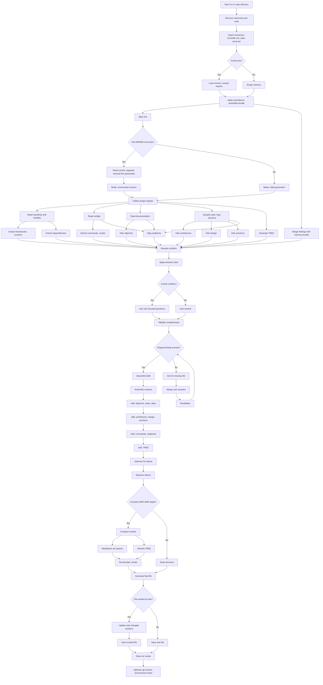

## Generating the project instructions file

Use the `/init` command to generate a `VALARMIND.md` file containing the project instructions. ValarMind automatically reads this file at the start of each chat session in that repository, so it can maintain persistent context about how you want it to work there. The goal is to avoid repeatedly searching for the same project information and to keep a consistent standard from start to finish.

## CLAUDE.md

Claude Code CLI is widely used as an AI agent tool for coding. It generates a `CLAUDE.md` file with the same purpose as `VALARMIND.md`, which is why this process includes a step to reference `CLAUDE.md` inside `VALARMIND.md`.

Even though we use it as a reference, the intent of `VALARMIND.md` is that, from the very beginning, it should contain not only general, summarized project information like `CLAUDE.md`, but also richer references and deeper details. This helps the agent understand not just what to do, but how to do it and why it should be done.

### Workflow



## Reference Model

The example below demonstrates the expected structure of `VALARMIND.md` using a fictional project "TaskFlow" - a task management API:

```markdown
# VALARMIND.md

## Project Objective

REST API for task and project management with JWT authentication, real-time notifications via WebSocket, and integration with external calendars.

## Stack

### Core

| Technology | Version | Role           |
| ---------- | ------- | -------------- |
| Node.js    | 20.11.0 | Runtime        |
| TypeScript | 5.3.3   | Language       |
| Fastify    | 4.25.2  | HTTP Framework |
| Prisma     | 5.8.1   | ORM            |
| PostgreSQL | 16      | Database       |

### Main Dependencies

| Package            | Version | Usage                  |
| ------------------ | ------- | ---------------------- |
| zod                | 3.22.4  | Schema validation      |
| @fastify/jwt       | 8.0.0   | Authentication         |
| @fastify/websocket | 10.0.1  | Real-time notifications|
| bullmq             | 5.1.0   | Job queues             |
| pino               | 8.17.2  | Structured logging     |

## Architecture

### Pattern

Modular monolith with domain separation (DDD lite)

### Layers

- **routes/**: HTTP handlers, input validation
- **services/**: Business logic, orchestration
- **repositories/**: Data access via Prisma
- **domain/**: Entities, value objects, domain rules
- **infra/**: External clients, queues, cache

### Main Flow

Request → Route (validates) → Service (processes) → Repository (persists) → Response

## Design

### Patterns

- Repository Pattern: isolate data access
- Result Pattern: errors as values (`Result<T, E>`)
- Factory: complex entity creation

### Conventions

- Files: `kebab-case.ts`
- Classes/Types: `PascalCase`
- Functions/variables: `camelCase`
- One file per exported class/function

## Practices

### Code

- Formatter: Biome (`bun format`)
- Linter: Biome + TypeScript strict
- Imports: absolute paths via `@/`

### Tests

- Framework: Bun Test
- E2E: Supertest + testcontainers
- Coverage: minimum 80%

### Git

- Commits: Conventional Commits
- Branch: `feat/`, `fix/`, `refactor/`
- PRs require 1 approval + green CI

## Commands

| Command          | Description               |
| ---------------- | ------------------------- |
| `bun dev`        | Server with hot-reload    |
| `bun test`       | Run unit tests            |
| `bun test:e2e`   | E2E tests with containers |
| `bun db:migrate` | Apply migrations          |
| `bun db:seed`    | Populate dev data         |
| `bun build`      | Production build          |

## Endpoints

| Method | Route          | Description               |
| ------ | -------------- | ------------------------- |
| POST   | /auth/login    | Authentication, returns JWT |
| POST   | /auth/refresh  | Renew token               |
| GET    | /tasks         | List user's tasks         |
| POST   | /tasks         | Create new task           |
| PATCH  | /tasks/:id     | Update task               |
| DELETE | /tasks/:id     | Remove task               |
| WS     | /notifications | Notifications channel     |

## Project Core

Core modules and files that form the heart of the application:

| Module          | Path                                      | Responsibility                               |
| --------------- | ----------------------------------------- | -------------------------------------------- |
| TaskService     | `src/services/task-service.ts`            | Orchestrates task CRUD, business validations |
| AuthService     | `src/services/auth-service.ts`            | Login, refresh token, JWT validation         |
| NotificationHub | `src/infra/websocket/notification-hub.ts` | Real-time event broadcast                    |
| TaskRepository  | `src/repositories/task-repository.ts`     | Task persistence and queries                 |
| Prisma Schema   | `prisma/schema.prisma`                    | Data model and relations                     |

## Sensitive Points

Critical areas that require special attention when modifying:

| Area          | Files                                            | Risk     | Precautions                                                    |
| ------------- | ------------------------------------------------ | -------- | -------------------------------------------------------------- |
| Authentication| `src/services/auth-service.ts`, `src/infra/jwt/` | High     | Never log tokens, validate expiration, use bcrypt for passwords|
| Permissions   | `src/middlewares/authorize.ts`                   | High     | Always verify ownership before operations on resources         |
| Migrations    | `prisma/migrations/`                             | Medium   | Test rollback, never delete production data without backup     |
| Rate Limiting | `src/middlewares/rate-limit.ts`                  | Medium   | Adjust limits per endpoint, monitor abuse                      |
| Secrets       | `.env`, `src/config/`                            | Critical | Never commit secrets, use environment variables                |

## TREE
```

taskflow/
├── src/
│ ├── domain/
│ │ ├── task/
│ │ └── user/
│ ├── services/
│ ├── repositories/
│ ├── routes/
│ ├── infra/
│ │ ├── database/
│ │ ├── queue/
│ │ └── cache/
│ └── index.ts
├── tests/
│ ├── unit/
│ └── e2e/
├── prisma/
│ ├── schema.prisma
│ └── migrations/
├── docs/
└── package.json

```

## Environment Variables

| Variable | Required | Description |
|----------|----------|-------------|
| DATABASE_URL | Yes | PostgreSQL connection string |
| JWT_SECRET | Yes | Key to sign tokens (min 32 chars) |
| JWT_EXPIRES_IN | No | Token expiration time (default: 1h) |
| REDIS_URL | Yes | Redis connection string for cache/queues |
| GOOGLE_CLIENT_ID | No | OAuth for Google Calendar integration |
| GOOGLE_CLIENT_SECRET | No | Google OAuth secret |

## External Integrations

| Service | Usage | Authentication | Docs |
|---------|-------|----------------|------|
| Google Calendar API | Bidirectional task sync with calendar | OAuth 2.0 | @docs/integrations/gcal.md |
| SendGrid | Transactional email sending | API Key | @docs/integrations/email.md |
| Sentry | Production error monitoring | DSN | https://docs.sentry.io |

## Troubleshooting

| Error | Probable Cause | Solution |
|-------|----------------|----------|
| `ECONNREFUSED :5432` | PostgreSQL offline | `docker compose up -d db` |
| `ECONNREFUSED :6379` | Redis offline | `docker compose up -d redis` |
| `JWT malformed` | Corrupted or expired token | Login again, verify JWT_SECRET |
| `P2002 Unique constraint` | Duplicate record in database | Check unique data before inserting |
| `TypeError: Cannot read property of undefined` | Object not loaded from database | Check includes/joins in Prisma queries |

## Snippets

Useful code snippets from core functions:

### Task creation with validation
```typescript
// src/services/task-service.ts
async createTask(userId: string, input: CreateTaskInput): Promise<Result<Task, TaskError>> {
  const validated = createTaskSchema.safeParse(input);
  if (!validated.success) {
    return err(TaskError.InvalidInput(validated.error));
  }

  const task = await this.taskRepo.create({
    ...validated.data,
    userId,
    status: TaskStatus.PENDING,
  });

  await this.notificationHub.broadcast(userId, { type: 'TASK_CREATED', task });
  return ok(task);
}
```

### Authentication middleware
```typescript
// src/middlewares/authenticate.ts
export const authenticate: FastifyPluginAsync = async (fastify) => {
  fastify.addHook('onRequest', async (request, reply) => {
    try {
      await request.jwtVerify();
    } catch (err) {
      reply.status(401).send({ error: 'Unauthorized' });
    }
  });
};
```

### Query with dynamic filters
```typescript
// src/repositories/task-repository.ts
async findByFilters(userId: string, filters: TaskFilters): Promise<Task[]> {
  return this.prisma.task.findMany({
    where: {
      userId,
      ...(filters.status && { status: filters.status }),
      ...(filters.dueDate && { dueDate: { lte: filters.dueDate } }),
    },
    orderBy: { createdAt: 'desc' },
  });
}
```

## References

- @CLAUDE.md
- @docs/architecture.md
- @docs/api-spec.yaml
```
