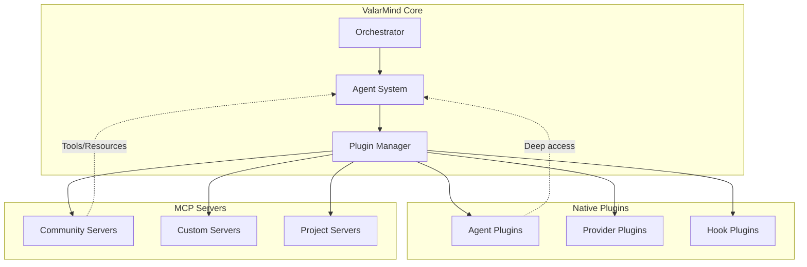
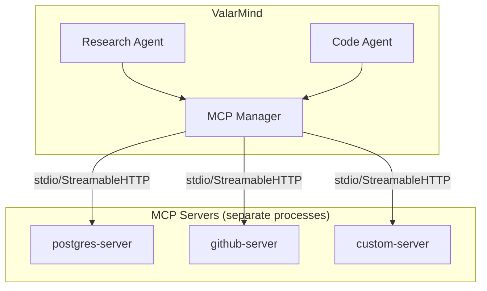
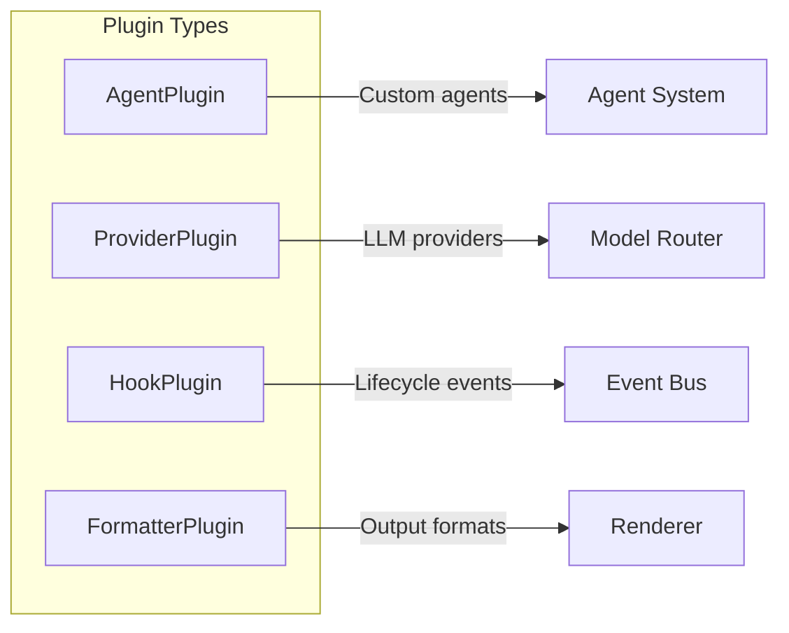

# Plugin Architecture

This document defines ValarMind's extensibility system, combining MCP (Model Context Protocol) for external tools and native plugins for deep core integration.

## Overview

ValarMind uses a hybrid plugin architecture that leverages existing ecosystems while maintaining flexibility for custom extensions.



## Architecture Decision

| Aspect | Native Plugins | MCP Servers |
|--------|----------------|-------------|
| Use case | Deep core access | External tools |
| Language | TypeScript only | Any language |
| Isolation | Same process | Separate process |
| Ecosystem | Build from scratch | Existing servers |
| Complexity | Higher | Lower |
| Performance | Lower latency | IPC overhead |

### When to Use Each

| Scenario | Recommendation |
|----------|----------------|
| Custom agent with special logic | Native Plugin |
| Database integration (Postgres, Redis) | MCP Server |
| Custom LLM provider | Native Plugin |
| Third-party API (Jira, Slack, GitHub) | MCP Server |
| Lifecycle hooks with state access | Native Plugin |
| File system tools | MCP Server |
| Project-specific tooling | MCP Server |

---

## MCP Integration

### What is MCP

Model Context Protocol (MCP) is an open protocol by Anthropic that standardizes how AI applications connect to external tools and data sources. Each MCP server exposes:

| Primitive | Description | Example |
|-----------|-------------|---------|
| Tools | Functions the agent can call | `run_sql`, `create_issue` |
| Resources | Data the agent can read | Database schemas, file contents |
| Prompts | Reusable prompt templates | Code review template |

### Architecture



### Configuration

```typescript
// .valarmind/config.json or valarmind.config.json
interface MCPConfig {
  servers: {
    [name: string]: MCPServerConfig;
  };
}

interface MCPServerConfig {
  // Local server via stdio
  command?: string;
  args?: string[];
  env?: Record<string, string>;

  // Remote server via StreamableHTTP
  url?: string;
  headers?: Record<string, string>;

  // Common options
  enabled?: boolean;
  timeout?: number;
  retries?: number;
}
```

### Configuration Examples

```json
{
  "mcp": {
    "servers": {
      "postgres": {
        "command": "npx",
        "args": ["-y", "@modelcontextprotocol/server-postgres"],
        "env": {
          "DATABASE_URL": "${DATABASE_URL}"
        }
      },

      "github": {
        "command": "npx",
        "args": ["-y", "@modelcontextprotocol/server-github"],
        "env": {
          "GITHUB_TOKEN": "${GITHUB_TOKEN}"
        }
      },

      "company-tools": {
        "url": "https://mcp.company.com/sse",
        "headers": {
          "Authorization": "Bearer ${MCP_TOKEN}"
        }
      },

      "project-tools": {
        "command": "bun",
        "args": ["run", ".valarmind/mcp/server.ts"]
      }
    }
  }
}
```

### Agent MCP Permissions

Each agent has explicit access to specific MCP servers:

```typescript
const agentMCPPermissions: Record<AgentType, string[] | '*'> = {
  orchestrator: [],
  search: [],
  research: '*',                           // All servers
  code: ['postgres', 'project-tools'],
  review: ['project-tools'],
  test: ['project-tools'],
  docs: ['confluence', 'notion'],
  qa: ['postgres', 'project-tools'],
  init: [],
};
```

### MCP Manager Implementation

```typescript
// src/plugins/mcp/manager.ts
import { Client } from '@modelcontextprotocol/sdk/client/index.js';
import { StdioClientTransport } from '@modelcontextprotocol/sdk/client/stdio.js';
import { StreamableHTTPClientTransport } from '@modelcontextprotocol/sdk/client/streamableHttp.js';

interface MCPTool {
  server: string;
  name: string;
  description: string;
  inputSchema: object;
}

export class MCPManager {
  private clients: Map<string, Client> = new Map();
  private config: MCPConfig;

  constructor(config: MCPConfig) {
    this.config = config;
  }

  async initialize(): Promise<void> {
    for (const [name, serverConfig] of Object.entries(this.config.servers)) {
      if (serverConfig.enabled === false) continue;
      await this.connect(name, serverConfig);
    }
  }

  private async connect(name: string, config: MCPServerConfig): Promise<void> {
    const transport = config.url
      ? new StreamableHTTPClientTransport(new URL(config.url))
      : new StdioClientTransport({
          command: config.command!,
          args: config.args,
          env: this.resolveEnv(config.env),
        });

    const client = new Client({
      name: 'valarmind',
      version: '1.0.0',
    });

    await client.connect(transport);
    this.clients.set(name, client);
  }

  async listTools(agentType: AgentType): Promise<MCPTool[]> {
    const permissions = agentMCPPermissions[agentType];
    const allowedServers = permissions === '*'
      ? Array.from(this.clients.keys())
      : permissions;

    const tools: MCPTool[] = [];

    for (const serverName of allowedServers) {
      const client = this.clients.get(serverName);
      if (!client) continue;

      const { tools: serverTools } = await client.listTools();
      tools.push(...serverTools.map(t => ({
        server: serverName,
        name: `${serverName}__${t.name}`,
        description: t.description ?? '',
        inputSchema: t.inputSchema,
      })));
    }

    return tools;
  }

  async callTool(
    fullName: string,
    args: Record<string, unknown>
  ): Promise<unknown> {
    const [serverName, toolName] = fullName.split('__');
    const client = this.clients.get(serverName);

    if (!client) {
      throw new Error(`MCP server not found: ${serverName}`);
    }

    const result = await client.callTool({
      name: toolName,
      arguments: args,
    });

    return result;
  }

  async listResources(serverName: string): Promise<Resource[]> {
    const client = this.clients.get(serverName);
    if (!client) return [];

    const { resources } = await client.listResources();
    return resources;
  }

  async readResource(serverName: string, uri: string): Promise<string> {
    const client = this.clients.get(serverName);
    if (!client) {
      throw new Error(`MCP server not found: ${serverName}`);
    }

    const result = await client.readResource({ uri });
    return result.contents[0]?.text ?? '';
  }

  async shutdown(): Promise<void> {
    for (const client of this.clients.values()) {
      await client.close();
    }
    this.clients.clear();
  }

  private resolveEnv(env?: Record<string, string>): Record<string, string> {
    if (!env) return {};

    const resolved: Record<string, string> = {};
    for (const [key, value] of Object.entries(env)) {
      resolved[key] = value.replace(/\$\{(\w+)\}/g, (_, name) =>
        process.env[name] ?? ''
      );
    }
    return resolved;
  }
}
```

### Creating Custom MCP Servers

For project-specific tools, create a local MCP server:

```typescript
// .valarmind/mcp/server.ts
import { McpServer } from '@modelcontextprotocol/sdk/server/mcp.js';
import { StdioServerTransport } from '@modelcontextprotocol/sdk/server/stdio.js';
import { z } from 'zod';

const server = new McpServer({
  name: 'project-tools',
  version: '1.0.0',
});

// Register a tool
server.tool(
  'run_migrations',
  'Run database migrations',
  {
    direction: z.enum(['up', 'down']),
    steps: z.number().default(1),
  },
  async ({ direction, steps }) => {
    const result = await runMigrations(direction, steps);
    return {
      content: [{ type: 'text', text: JSON.stringify(result, null, 2) }],
    };
  }
);

// Register a resource
server.resource(
  'project://schemas',
  'Database schemas',
  async () => ({
    contents: [{
      uri: 'project://schemas',
      mimeType: 'application/json',
      text: JSON.stringify(await getSchemas()),
    }],
  })
);

// Register a prompt template
server.prompt(
  'migration_review',
  'Review a database migration',
  [{ name: 'migration_file', required: true }],
  async ({ migration_file }) => ({
    messages: [{
      role: 'user',
      content: {
        type: 'text',
        text: `Review this migration for safety and best practices:\n\n${await readFile(migration_file)}`,
      },
    }],
  })
);

// Start server
const transport = new StdioServerTransport();
await server.connect(transport);
```

### Popular MCP Servers

| Server | Package | Use Case |
|--------|---------|----------|
| PostgreSQL | `@modelcontextprotocol/server-postgres` | Database queries |
| SQLite | `@modelcontextprotocol/server-sqlite` | Local databases |
| GitHub | `@modelcontextprotocol/server-github` | Issues, PRs, repos |
| Filesystem | `@modelcontextprotocol/server-filesystem` | File operations |
| Puppeteer | `@modelcontextprotocol/server-puppeteer` | Browser automation |
| Slack | `@modelcontextprotocol/server-slack` | Messaging |
| Google Drive | `@modelcontextprotocol/server-gdrive` | Document access |
| Brave Search | `@modelcontextprotocol/server-brave-search` | Web search |

---

## Native Plugins

Native plugins provide deep integration with ValarMind's core for scenarios where MCP is insufficient.

### Plugin Types



### Base Plugin Interface

```typescript
// src/plugins/types.ts
interface Plugin {
  name: string;
  version: string;
  description?: string;

  // Lifecycle
  activate(context: PluginContext): Promise<void>;
  deactivate(): Promise<void>;
}

interface PluginContext {
  config: Config;
  logger: Logger;
  eventBus: EventBus;
  mcpManager: MCPManager;

  // Utilities
  askUser: <T>(prompt: Prompt) => Promise<T>;
  readFile: (path: string) => Promise<string>;
  writeFile: (path: string, content: string) => Promise<void>;
}

interface PluginManifest {
  name: string;
  version: string;
  type: 'agent' | 'provider' | 'hook' | 'formatter';
  main: string;
  dependencies?: Record<string, string>;
  permissions?: string[];
}
```

### Agent Plugin

```typescript
// src/plugins/types/agent.ts
interface AgentPlugin extends Plugin {
  type: 'agent';

  // Agent definition
  agentType: string;
  permissions: ToolPermissions;
  tools: string[];
  timeout: { default: number; max: number };

  // Execution
  execute(task: AgentTask, context: AgentContext): Promise<AgentResult>;

  // Optional hooks
  onTaskReceived?(task: AgentTask): Promise<AgentTask>;
  onResultReady?(result: AgentResult): Promise<AgentResult>;
}

// Example: Terraform Agent Plugin
const terraformAgent: AgentPlugin = {
  name: 'terraform-agent',
  version: '1.0.0',
  type: 'agent',

  agentType: 'terraform',
  permissions: { read: true, write: true, execute: true },
  tools: ['Bash', 'Read', 'Write', 'Edit', 'Glob'],
  timeout: { default: 300, max: 600 },

  async activate(context) {
    // Verify terraform is installed
    const { exitCode } = await context.exec('terraform version');
    if (exitCode !== 0) {
      throw new Error('Terraform not found');
    }
  },

  async deactivate() {},

  async execute(task, context) {
    // Agent implementation
    const plan = await context.exec('terraform plan -out=tfplan');

    return {
      task: task.id,
      success: plan.exitCode === 0,
      output: plan.stdout,
      artifacts: ['tfplan'],
    };
  },
};
```

### Provider Plugin

```typescript
// src/plugins/types/provider.ts
interface ProviderPlugin extends Plugin {
  type: 'provider';

  // Provider info
  providerName: string;
  models: ModelInfo[];

  // API
  chat(request: ChatRequest): AsyncIterable<ChatChunk>;
  complete(request: CompleteRequest): Promise<CompleteResponse>;

  // Optional
  listModels?(): Promise<ModelInfo[]>;
  estimateTokens?(text: string): number;
}

interface ModelInfo {
  id: string;
  name: string;
  contextWindow: number;
  pricing?: { input: number; output: number };
}

// Example: Ollama Provider Plugin
const ollamaProvider: ProviderPlugin = {
  name: 'ollama-provider',
  version: '1.0.0',
  type: 'provider',

  providerName: 'ollama',
  models: [
    { id: 'llama3.2', name: 'Llama 3.2', contextWindow: 128000 },
    { id: 'codellama', name: 'Code Llama', contextWindow: 16000 },
    { id: 'mistral', name: 'Mistral 7B', contextWindow: 32000 },
  ],

  async activate(context) {
    // Verify Ollama is running
    try {
      await fetch('http://localhost:11434/api/tags');
    } catch {
      throw new Error('Ollama not running on localhost:11434');
    }
  },

  async deactivate() {},

  async *chat(request) {
    const response = await fetch('http://localhost:11434/api/chat', {
      method: 'POST',
      body: JSON.stringify({
        model: request.model,
        messages: request.messages,
        stream: true,
      }),
    });

    const reader = response.body!.getReader();
    const decoder = new TextDecoder();

    while (true) {
      const { done, value } = await reader.read();
      if (done) break;

      const chunk = JSON.parse(decoder.decode(value));
      yield { content: chunk.message?.content ?? '' };
    }
  },

  async complete(request) {
    const response = await fetch('http://localhost:11434/api/generate', {
      method: 'POST',
      body: JSON.stringify({
        model: request.model,
        prompt: request.prompt,
        stream: false,
      }),
    });

    const data = await response.json();
    return { content: data.response };
  },
};
```

### Hook Plugin

```typescript
// src/plugins/types/hook.ts
interface HookPlugin extends Plugin {
  type: 'hook';

  // Hook subscriptions
  hooks: {
    [K in HookName]?: HookHandler<K>;
  };
}

type HookName =
  | 'session:start'
  | 'session:end'
  | 'prompt:before'
  | 'prompt:after'
  | 'tool:before'
  | 'tool:after'
  | 'agent:spawn'
  | 'agent:complete'
  | 'error';

type HookHandler<K extends HookName> = (
  event: HookEvent<K>,
  context: PluginContext
) => Promise<HookResult>;

interface HookResult {
  continue: boolean;
  modified?: unknown;
  message?: string;
}

// Example: Audit Logger Plugin
const auditLogger: HookPlugin = {
  name: 'audit-logger',
  version: '1.0.0',
  type: 'hook',

  hooks: {
    'tool:before': async (event, context) => {
      await context.logger.info('Tool call', {
        tool: event.tool,
        args: event.args,
        timestamp: new Date().toISOString(),
      });
      return { continue: true };
    },

    'tool:after': async (event, context) => {
      await context.logger.info('Tool result', {
        tool: event.tool,
        success: event.success,
        duration: event.duration,
      });
      return { continue: true };
    },

    'error': async (event, context) => {
      await context.logger.error('Error occurred', {
        error: event.error,
        stack: event.stack,
      });
      return { continue: true };
    },
  },

  async activate(context) {
    context.logger.info('Audit logger activated');
  },

  async deactivate() {},
};
```

### Formatter Plugin

```typescript
// src/plugins/types/formatter.ts
interface FormatterPlugin extends Plugin {
  type: 'formatter';

  // Format info
  formatName: string;
  fileExtension: string;
  mimeType: string;

  // Formatting
  format(result: AgentResult): string;
  formatStream?(chunks: AsyncIterable<string>): AsyncIterable<string>;
}

// Example: JUnit XML Formatter
const junitFormatter: FormatterPlugin = {
  name: 'junit-formatter',
  version: '1.0.0',
  type: 'formatter',

  formatName: 'junit',
  fileExtension: '.xml',
  mimeType: 'application/xml',

  format(result) {
    const testcases = result.tests?.map(t => `
      <testcase name="${t.name}" classname="${t.file}" time="${t.duration}">
        ${t.passed ? '' : `<failure message="${t.error}">${t.stack}</failure>`}
      </testcase>
    `).join('\n');

    return `<?xml version="1.0" encoding="UTF-8"?>
<testsuite name="ValarMind" tests="${result.tests?.length ?? 0}">
${testcases}
</testsuite>`;
  },

  async activate() {},
  async deactivate() {},
};
```

---

## Plugin Manager

### Implementation

```typescript
// src/plugins/manager.ts
import { join } from 'path';
import { existsSync } from 'fs';

interface PluginRegistry {
  agents: Map<string, AgentPlugin>;
  providers: Map<string, ProviderPlugin>;
  hooks: Map<string, HookPlugin>;
  formatters: Map<string, FormatterPlugin>;
}

export class PluginManager {
  private registry: PluginRegistry = {
    agents: new Map(),
    providers: new Map(),
    hooks: new Map(),
    formatters: new Map(),
  };

  private context: PluginContext;

  constructor(context: PluginContext) {
    this.context = context;
  }

  async loadPlugins(): Promise<void> {
    // Load from config
    const pluginPaths = [
      // Global plugins
      join(process.env.HOME!, '.config/valarmind/plugins'),
      // Project plugins
      join(process.cwd(), '.valarmind/plugins'),
    ];

    for (const basePath of pluginPaths) {
      if (!existsSync(basePath)) continue;

      const entries = await Bun.file(basePath).text();
      // ... load each plugin
    }

    // Load from npm packages
    const config = this.context.config;
    for (const packageName of config.plugins ?? []) {
      await this.loadFromPackage(packageName);
    }
  }

  private async loadFromPackage(packageName: string): Promise<void> {
    const module = await import(packageName);
    const plugin = module.default as Plugin;

    await this.register(plugin);
  }

  async register(plugin: Plugin): Promise<void> {
    // Validate plugin
    this.validate(plugin);

    // Activate
    await plugin.activate(this.context);

    // Register by type
    switch ((plugin as any).type) {
      case 'agent':
        this.registry.agents.set(plugin.name, plugin as AgentPlugin);
        break;
      case 'provider':
        this.registry.providers.set(plugin.name, plugin as ProviderPlugin);
        break;
      case 'hook':
        this.registry.hooks.set(plugin.name, plugin as HookPlugin);
        break;
      case 'formatter':
        this.registry.formatters.set(plugin.name, plugin as FormatterPlugin);
        break;
    }

    this.context.logger.info(`Plugin loaded: ${plugin.name}`);
  }

  getAgent(name: string): AgentPlugin | undefined {
    return this.registry.agents.get(name);
  }

  getProvider(name: string): ProviderPlugin | undefined {
    return this.registry.providers.get(name);
  }

  getFormatter(name: string): FormatterPlugin | undefined {
    return this.registry.formatters.get(name);
  }

  async triggerHook<K extends HookName>(
    hookName: K,
    event: HookEvent<K>
  ): Promise<HookResult> {
    for (const plugin of this.registry.hooks.values()) {
      const handler = plugin.hooks[hookName];
      if (!handler) continue;

      const result = await handler(event, this.context);
      if (!result.continue) {
        return result;
      }
    }

    return { continue: true };
  }

  async shutdown(): Promise<void> {
    for (const plugins of Object.values(this.registry)) {
      for (const plugin of plugins.values()) {
        await plugin.deactivate();
      }
    }
  }

  private validate(plugin: Plugin): void {
    if (!plugin.name || !plugin.version) {
      throw new Error('Plugin must have name and version');
    }
  }
}
```

### Plugin Configuration

```json
{
  "plugins": [
    "valarmind-plugin-terraform",
    "valarmind-plugin-ollama",
    "@company/valarmind-plugin-internal"
  ],

  "pluginSettings": {
    "valarmind-plugin-terraform": {
      "workspaceDir": "./terraform"
    },
    "valarmind-plugin-ollama": {
      "host": "http://localhost:11434"
    }
  }
}
```

---

## Plugin Distribution

### Package Structure

```
valarmind-plugin-example/
├── package.json
├── manifest.json
├── src/
│   └── index.ts
├── dist/
│   └── index.js
└── README.md
```

### package.json

```json
{
  "name": "valarmind-plugin-example",
  "version": "1.0.0",
  "main": "dist/index.js",
  "types": "dist/index.d.ts",
  "keywords": ["valarmind", "valarmind-plugin"],
  "peerDependencies": {
    "valarmind": "^1.0.0"
  },
  "engines": {
    "valarmind": ">=1.0.0"
  }
}
```

### manifest.json

```json
{
  "name": "example",
  "version": "1.0.0",
  "type": "agent",
  "main": "dist/index.js",
  "permissions": ["read", "write", "execute"],
  "dependencies": {
    "terraform": ">=1.0.0"
  }
}
```

### Distribution Methods

| Method | Pros | Cons |
|--------|------|------|
| npm | Standard ecosystem, versioning | Publication overhead |
| Git repos | Easy for private plugins | Manual updates |
| Local paths | Fast development | No sharing |
| Company registry | Internal control | Setup required |

---

## Security Considerations

### Plugin Sandboxing

```typescript
interface PluginSandbox {
  // Allowed operations
  allowedTools: string[];
  allowedPaths: string[];
  allowedCommands: string[];
  allowedNetworkHosts: string[];

  // Limits
  maxMemoryMB: number;
  maxCpuPercent: number;
  timeoutMs: number;
}

// Default sandbox for plugins
const defaultSandbox: PluginSandbox = {
  allowedTools: ['Read', 'Glob', 'Grep'],
  allowedPaths: ['./**', '!.env*', '!**/secrets/**'],
  allowedCommands: [],
  allowedNetworkHosts: [],
  maxMemoryMB: 512,
  maxCpuPercent: 50,
  timeoutMs: 30000,
};
```

### MCP Server Isolation

| Aspect | Implementation |
|--------|----------------|
| Process isolation | Each server runs in separate process |
| Communication | JSON-RPC over stdio or StreamableHTTP |
| Permissions | Agent-level access control |
| Resource limits | Configurable timeouts |
| Secrets | Environment variable interpolation |

### Security Checklist

| Check | Description |
|-------|-------------|
| Code review | Review plugin source before installation |
| Permissions | Grant minimal required permissions |
| Network | Restrict network access when possible |
| Secrets | Never hardcode credentials in plugins |
| Updates | Keep plugins updated for security patches |
| Audit | Log all plugin actions |

---

## Implementation Roadmap

### Phase 1: MCP Foundation

- [x] MCP Manager with stdio/StreamableHTTP transport
- [x] Server configuration loading
- [x] Agent permission mapping
- [x] Tool namespacing (`mcp__server__tool`)
- [x] Tool bridge (MCP tools → native Tool interface)
- [ ] Resource access

### Phase 2: Native Plugin System

- [x] Plugin interface definitions (HookPlugin, AgentPlugin, ProviderPlugin)
- [x] Plugin Manager implementation (register, triggerHook, shutdown)
- [x] Agent plugin support
- [x] Provider plugin support
- [x] Hook plugin support

### Phase 3: Security

- [x] Per-agent sandbox profiles (filesystem deny/allow, network domains)
- [x] SandboxManager (macOS sandbox-exec, Linux bubblewrap)
- [x] Sandbox integration with bash tool
- [ ] Permission prompts for sensitive operations
- [ ] Audit logging

### Phase 4: Distribution & Polish

- [ ] npm package discovery (`valarmind-plugin-*`)
- [ ] Local plugin loading
- [ ] Manifest validation
- [ ] Version compatibility checks
- [ ] Hot reload for development
- [ ] Plugin marketplace CLI (`valarmind plugin search`)

---

## References

- [Model Context Protocol](https://modelcontextprotocol.io/)
- [MCP TypeScript SDK](https://github.com/modelcontextprotocol/typescript-sdk)
- [MCP Servers Repository](https://github.com/modelcontextprotocol/servers)
- @docs/agents.md
- @docs/cli.md
