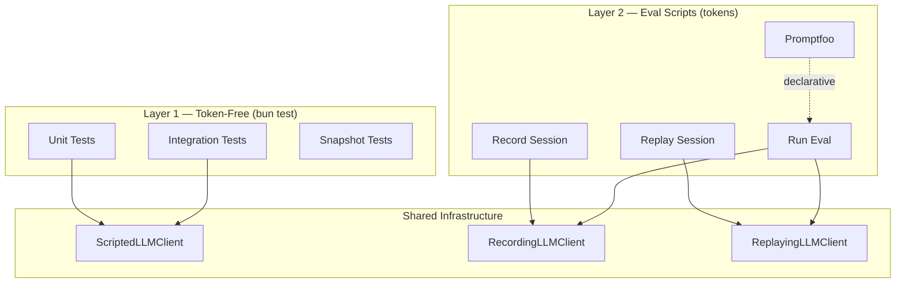

# Testing Architecture

This document defines ValarMind Code's testing strategy, covering token-free CI tests for agent intelligence, eval scripts for live LLM assessment, and the shared test infrastructure.

## Overview

The test suite is organized in two layers: **token-free tests** that run in CI with scripted LLM mocks, and **eval scripts** that consume real tokens for end-to-end assessment.



## Test Layers

| Layer | Purpose | Token Cost | Runs In |
|-------|---------|------------|---------|
| Unit tests | Prompt snapshots, permissions, timeouts | Zero | CI (`bun test`) |
| Integration tests | Runner flow, orchestrator trajectory, context overflow | Zero | CI (`bun test`) |
| Record/Replay | Capture real sessions, replay deterministically | Once per recording | Local |
| Eval runner | Metrics: pass@k, latency, tokens | Per run | Local |
| Promptfoo | Declarative evals, LLM-as-judge | Per run | Local |

## Shared Infrastructure

### ScriptedLLMClient

Located at `tests/helpers/scripted-llm-client.ts`. Implements `LLMClient` with queued responses and call capture.

```typescript
// Queue-based: returns responses in order
const client = new ScriptedLLMClient([
    { content: null, toolCalls: [globCall], finishReason: 'tool_calls' },
    { content: 'Found 5 files', finishReason: 'stop' },
])

// Factory methods
ScriptedLLMClient.fromStrings(['answer1', 'answer2'])
ScriptedLLMClient.withToolCalls([toolCall], 'final answer')
ScriptedLLMClient.withError(new Error('API down'))

// Assertion helpers
client.assertToolsProvided(0, ['glob', 'grep'])
client.getCall(1).params.messages  // inspect captured messages
```

| Feature | Description |
|---------|-------------|
| `capturedCalls` | Array of `{ params, timestamp }` for every `chat()` call |
| `chatStream` | Simulates streaming by chunking content |
| `fromStrings()` | Quick factory for simple text responses |
| `withToolCalls()` | Creates tool_calls → stop sequence |
| `withError()` | Throws on first call |
| `assertToolsProvided()` | Verifies tool definitions sent to LLM |

### Helper Functions

| Function | Purpose |
|----------|---------|
| `makeToolCall(name, args)` | Creates a `ToolCall` with random ID |
| `makeScriptedResponse(content)` | Creates a stop response |
| `makeToolCallResponse(calls, content)` | Creates a tool_calls response |

## Token-Free Tests (Layer 1)

### Prompt Snapshots

**File:** `tests/unit/agents/prompt-snapshots.test.ts`

Snapshot test for `buildSystemPrompt()` of all 8 agents plus the Orchestrator system prompt. Detects unintentional prompt drift.

| Test | What It Validates |
|------|-------------------|
| Per-agent snapshot (x8) | `agent.buildSystemPrompt(context)` matches snapshot |
| Orchestrator snapshot | `ORCHESTRATOR_SYSTEM_PROMPT` matches snapshot |
| Code agent + conventions | Conventions section appended when present |
| Review agent + conventions | Same conventions behavior as Code agent |
| Code agent without conventions | No `## Conventions` section when empty |
| Init excludeProjectContext | `excludeProjectContext === true` |
| Non-init includeProjectContext | `excludeProjectContext === false` for all others |

Update snapshots after intentional prompt changes:

```bash
bun test tests/unit/agents/prompt-snapshots.test.ts --update-snapshots
```

### Tool Permissions

**File:** `tests/unit/agents/tool-permissions.test.ts`

Validates that each agent's `allowedTools` are consistent with its `permissions` from `AGENT_PERMISSIONS`.

| Test Category | What It Validates |
|---------------|-------------------|
| Permissions match | `agent.permissions === AGENT_PERMISSIONS[agent.type]` |
| Tool consistency | Every allowed tool's required permission is granted |
| Read-only enforcement | Agents without `write` have no `write_file`/`edit_file` |
| No-execute enforcement | Agents without `execute` have no `bash` |
| No-web enforcement | Agents without `web` have no `web_search` |
| Specific constraints | Per-agent checks (search read-only, qa execute+no-write, etc.) |
| Model suffix | Only research agent has `:online` suffix |

### Timeout & AbortSignal

**File:** `tests/unit/agents/timeout-abort.test.ts`

Tests that the `AgentRunner` respects timeouts and abort signals.

| Test | What It Validates |
|------|-------------------|
| Timeout fires | Agent with 50ms timeout + slow LLM → `success: false` |
| Internal abort stops loop | Runner's AbortController stops iteration |
| Event emitted | `agent:error` emitted with correct `agentType` and `taskId` |
| Timeout cap | `timeoutOverride` capped at `agent.timeout.max * 3` |
| Fast completion | Fast LLM completes before timeout |

### Agent Runner Flow

**File:** `tests/integration/agent-runner-flow.test.ts`

End-to-end test of `AgentRunner.run()` with `ScriptedLLMClient`.

| Test | What It Validates |
|------|-------------------|
| Single tool call | LLM calls tool → sees result → returns stop |
| Multi-tool | Two tool calls in one response, both executed |
| Truncation recovery | `finishReason: 'length'` → continuation prompt appended |
| Hook invocation | PreToolUse/PostToolUse called with correct env vars |
| Tool error | `executeSafe` error → LLM receives `ERROR:` prefix |
| Tool definitions | Tools provided to LLM match agent's allowed tools |
| Max turns | Exhausting `maxTurns` returns `success: false` |
| Events | `agent:start` → `tool:before` → `tool:after` → `agent:complete` |
| Model suffix | `modelSuffix` applied when `defaultModel` is set |

### Orchestrator Trajectory

**File:** `tests/integration/orchestrator-trajectory.test.ts`

Verifies the exact sequence of agents invoked by the Orchestrator.

| Test | Expected Trajectory |
|------|---------------------|
| search → code | `dependsOn` resolves correctly |
| [search, search] → code | Parallel tasks before dependent |
| Quality gates | `code → review → qa` (multi-file) |
| Auto-fix loop | `code → review(fail) → code(fix) → review(pass) → qa` |
| Independent failure | Failed task doesn't block independent tasks |
| Three-step chain | `search → code → test` |
| No quality gates | Single non-risky file → only `code` |

### Context Overflow

**File:** `tests/integration/context-overflow.test.ts`

Tests PromptBuilder overflow handling and runner message trimming.

| Test | What It Validates |
|------|-------------------|
| Budget exceeded | Lower-priority section dropped when total > hardCap |
| Within budget | Both sections included when fits |
| System-only | Large system prompt fills budget, project context dropped |
| Priority ordering | Higher priority sections included first |
| 50k projectContext | Huge context truncated by PromptBuilder |
| Runner trim | Messages trimmed after many large tool calls |
| Truncation marker | `[Previous conversation truncated]` present after trim |
| No trim (small) | Small messages not trimmed |
| excludeProjectContext | Init agent's project context excluded |
| includeProjectContext | Normal agent's project context included |

## Eval Scripts (Layer 2)

### Record Session

**File:** `scripts/eval/record-session.ts`

Wraps a real LLM client and saves every request/response pair to JSONL.

```bash
bun run eval:record -- --name search-flow --task "Find test files"
# Output: fixtures/eval/search-flow/session.jsonl
```

Each line in the JSONL file is a `RecordedExchange`:

```typescript
interface RecordedExchange {
    timestamp: string
    request: { model?: string; messages: ChatMessage[]; tools?: ToolDefinition[] }
    response: ChatResponse
    latencyMs: number
}
```

### Replay Session

**File:** `scripts/eval/replay-session.ts`

Loads a JSONL fixture and returns responses deterministically.

```bash
bun run eval:replay -- --fixture fixtures/eval/smoke/session.jsonl
bun run eval:replay -- --fixture fixtures/eval/smoke/session.jsonl --strict
```

| Mode | Behavior |
|------|----------|
| Relaxed (default) | Returns responses regardless of input, logs mismatches |
| Strict | Validates message roles and tool names match, throws on mismatch |

### Run Eval

**File:** `scripts/eval/run-eval.ts`

Executes evaluation cases with assertions and produces a JSON report.

```bash
bun run eval:run                    # live mode (consumes tokens)
bun run eval:run -- --replay        # replay mode (zero tokens)
bun run eval:run -- --case search   # run specific case
```

Assertion types:

| Type | Description |
|------|-------------|
| `trajectory_contains` | Agent trajectory includes specified agents |
| `output_matches` | Output contains a string pattern |
| `files_modified` | Number of files modified matches |
| `no_errors` | No error strings in output |

Report saved to `fixtures/eval/last-report.json` with pass rate, avg tokens, and avg latency per case.

### Promptfoo

**File:** `scripts/eval/promptfoo.yaml`

Declarative evals using [Promptfoo](https://promptfoo.dev/) for orchestrator routing, format compliance, and LLM-as-judge.

```bash
bun run eval:promptfoo
```

| Eval | What It Tests |
|------|---------------|
| Search routing | Search task → plan includes search agent |
| Code routing | Code task → plan includes search + code agents |
| Direct answer | Question → plain text (no JSON plan) |
| Docs routing | Doc request → plan includes docs agent |
| Test routing | Test request → plan includes test agent |
| Token budget | Complex task under cost threshold |
| JSON structure | Plan output is valid JSON with required fields |

## File Structure

```
tests/
├── helpers/
│   └── scripted-llm-client.ts       # ScriptedLLMClient + factories
├── unit/
│   └── agents/
│       ├── prompt-snapshots.test.ts  # Snapshot regression
│       ├── tool-permissions.test.ts  # Permission consistency
│       ├── timeout-abort.test.ts     # Timeout & abort behavior
│       └── __snapshots__/            # Bun test snapshots
├── integration/
│   ├── agent-runner-flow.test.ts     # Runner end-to-end
│   ├── orchestrator-trajectory.test.ts # Agent execution order
│   ├── context-overflow.test.ts      # Context limits
│   ├── orchestrator-flow.test.ts     # (existing) Orchestrator basic flow
│   └── plan-mode.test.ts            # (existing) Plan create/approve/reject
scripts/
└── eval/
    ├── record-session.ts             # Record live LLM sessions
    ├── replay-session.ts             # Replay from fixtures
    ├── run-eval.ts                   # Eval runner with metrics
    └── promptfoo.yaml                # Declarative evals
fixtures/
└── eval/                             # Recorded sessions and reports
```

## Running Tests

```bash
# All tests (token-free, CI-safe)
bun test

# Specific test file
bun test tests/unit/agents/prompt-snapshots.test.ts

# Update snapshots after intentional prompt changes
bun test --update-snapshots

# Eval scripts (consume tokens)
bun run eval:record -- --name smoke --task "Find test files"
bun run eval:replay -- --fixture fixtures/eval/smoke/session.jsonl
bun run eval:run
bun run eval:promptfoo
```
