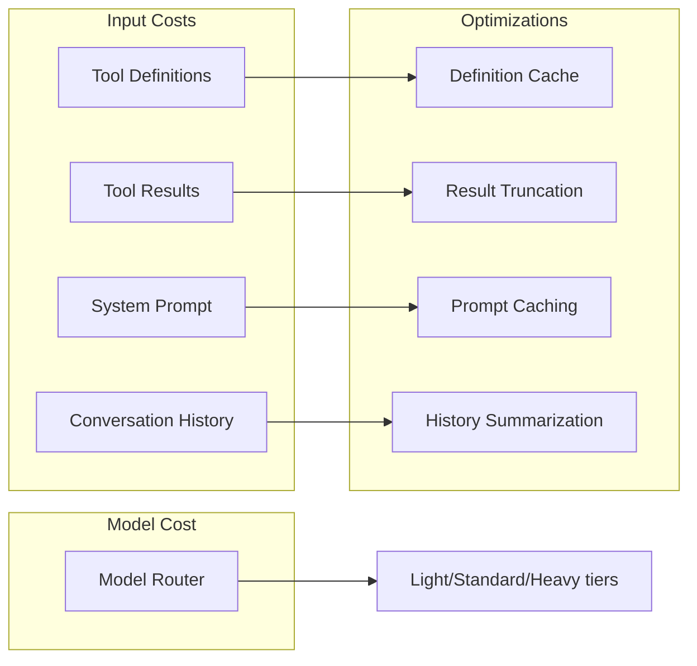
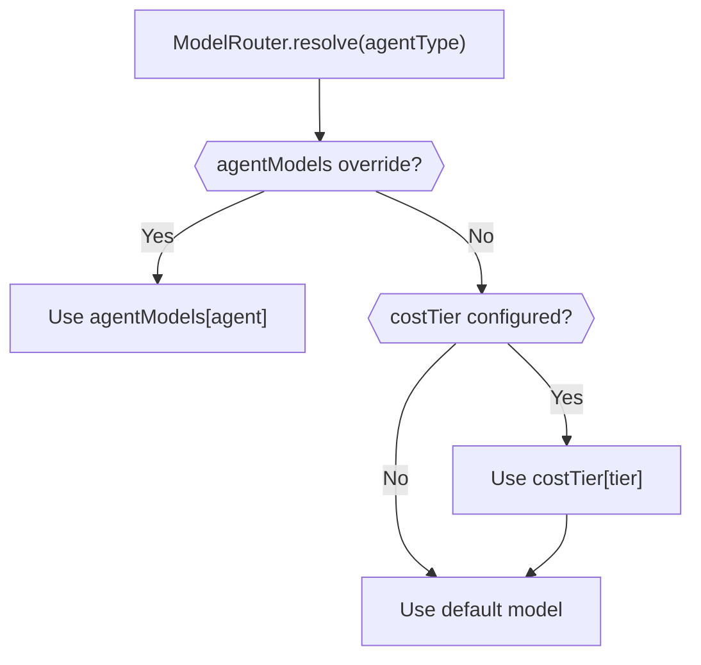
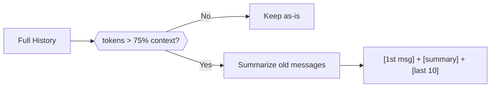

# Token Cost Optimization

This document describes the strategies implemented to reduce token consumption and monetary cost across ValarMind Code's multi-agent system.

## Overview

Every turn of every agent consumes tokens (input + output). With 9 agents and multiple turns per task, costs accumulate quickly. The optimization strategies target 5 different waste points across the system.



| # | Strategy | Component | Estimated Savings |
|---|----------|-----------|-------------------|
| 1 | Tool Definition Cache | `ToolRegistry` | ~800-2000 tok/turn |
| 2 | Tool Result Truncation | `AgentRunner` | ~200-1500 tok/turn |
| 3 | Model Router | `ModelRouter` | 50-80% cost/light task |
| 4 | Prompt Caching | `LLMClient` | Variable (provider-dependent) |
| 5 | History Summarization | `Orchestrator` | ~40-60% of long history |

---

## Tool Definition Cache

Agent: all | File: `src/tools/registry.ts`

### Problem

`zodToJsonSchema()` was called every turn of every agent to convert Zod schemas into JSON Schema. Same agent, same tools, same result — repeated processing and serialization overhead.

### Solution

A `Map<AgentType, ToolDefinition[]>` caches computed definitions. Invalidation is granular to minimize cache misses:

| Mutation Method | Invalidation Strategy |
|-----------------|-----------------------|
| `register()` | `clear()` — any new tool can affect any agent |
| `registerForAgent()` | `delete(agentType)` — only invalidates the affected agent |
| `appendForAgent()` | `delete(agentType)` — only invalidates the affected agent |

```typescript
getToolDefinitions(agentType: AgentType): ToolDefinition[] {
    const cached = this.definitionCache.get(agentType)
    if (cached) return cached

    const defs = this.getToolsForAgent(agentType).map((tool) => ({
        type: 'function' as const,
        function: {
            name: tool.name,
            description: tool.description,
            parameters: zodToJsonSchema(tool.parameters),
        },
    }))

    this.definitionCache.set(agentType, defs)
    return defs
}
```

---

## Tool Result Truncation

Agent: all | File: `src/agents/runner.ts`

### Problem

Tools like `grep` or `read_file` can return 10k-100k chars. All of this goes as context in the next LLM call, even though the model rarely needs the full content.

### Solution

Results exceeding 8000 chars are truncated, preserving head (opening context) and tail (final results):

| Parameter | Value |
|-----------|-------|
| Max chars | 8000 |
| Head preserved | 3000 chars |
| Tail preserved | 2000 chars |
| Error max | 2000 chars |

The truncation marker includes a count of removed lines:

```
[... 47 lines truncated for context efficiency ...]
```

### Rationale

- **Head** preserves opening context: file headers, first search results, column names
- **Tail** preserves final output: last results, summaries, exit codes
- **Middle** is typically redundant: repetitive search matches, intermediate log lines

---

## Model Router

Agents: all | Files: `src/llm/model-router.ts`, `src/config/schema.ts`, `src/config/defaults.ts`

### Problem

All agents used the same model. Agents performing simple tasks (glob, grep, summarize) do not need expensive models.

### Solution

Route agents to different models based on cost tier:



### Cost Tiers

| Tier | Agents | Default Model |
|------|--------|---------------|
| Light | Search, Research, QA | `google/gemini-2.5-flash` |
| Standard | Code, Test, Docs, Review, Init | `anthropic/claude-sonnet-4.5` |
| Heavy | (reserved for user config) | `anthropic/claude-sonnet-4.5` |

The Orchestrator uses the default config model and does not participate in the tier system.

### Configuration

Override per agent via `agentModels`, or change entire tiers via `costTier`:

```json
{
  "costTier": {
    "light": "google/gemini-2.5-flash",
    "standard": "anthropic/claude-sonnet-4.5",
    "heavy": "anthropic/claude-opus-4"
  },
  "agentModels": {
    "code": "anthropic/claude-opus-4"
  }
}
```

Resolution priority: `agentModels[agent]` > `costTier[tier]` > `default`

---

## Prompt Caching

Agent: all | Files: `src/llm/client.ts`, `src/llm/types.ts`

### Problem

Every LLM call sends the system prompt and project context (VALARMIND.md) as input tokens. Between turns of the same agent, this prefix is nearly identical.

### Solution

A `cacheControl: boolean` flag on `ChatParams`. When enabled, sends a cache header to OpenRouter:

```typescript
extra_body: { cache_control: { type: 'ephemeral' } }
```

Anthropic models recognize this header and charge cache tokens (significantly cheaper) instead of full input tokens for the identical prefix.

### Coverage

| Method | cacheControl |
|--------|-------------|
| `chat()` | Yes |
| `chatStream()` | Yes |

Enabled in both `AgentRunner` (all agent calls) and `Orchestrator` (`process()`, `createPlan()`).

---

## History Summarization

Agent: Orchestrator | Files: `src/llm/history-summarizer.ts`, `src/agents/orchestrator/orchestrator.ts`

### Problem

In long sessions, the Orchestrator's conversation history grows until it exceeds the context window. Previously, old messages were simply discarded — losing decisions, modified files, and important context.

### Solution

When `trimHistory()` detects tokens exceeding 75% of the context window:

1. Preserves the first message and the last 10
2. Summarizes intermediate messages via LLM into 2-4 bullet points
3. Inserts as `[Previous conversation summary]`



### Fallback Behavior

| Scenario | Behavior |
|----------|----------|
| LLM summarization succeeds | Summary inserted as user message |
| LLM summarization fails | `[Previous conversation summary unavailable]` + error logged |
| History exceeds 50 messages after summarization | Truncated to last 50 (safety net) |

The summarization model uses `modelRouter?.resolve()` (default config model). The `maxTokens` for the summary call is capped at 300.

---

## Discarded Strategy: TOON on Project Context

### Attempt

Compact VALARMIND.md and local.md with TOON encoding before injecting into agent context.

### Why It Failed

TOON is designed for **JSON objects and arrays**, not Markdown strings. For strings containing `\n`, `:`, `#`, `-`:

1. `isSafeUnquoted()` returns `false` (contains colons, newlines, etc.)
2. The result is the string **escaped and quoted** — making it LARGER than the original
3. The 15% threshold in `compactText()` correctly rejected the result

### Resolution

The `compactText()` function was kept in `compactor.ts` (useful for structured data like `state.json`) but removed from `context-loader.ts`. Future Markdown compaction should use alternative strategies such as LLM summarization or low-priority section removal.

---

## Tests

| Component | Test File | What It Covers |
|-----------|-----------|----------------|
| ToolRegistry cache | `tests/unit/tools/registry-cache.test.ts` | Cache hit, invalidation by `register`/`registerForAgent`/`appendForAgent`, deduplication |
| formatToolResult | `tests/unit/agents/tool-result-truncation.test.ts` | Truncation > 8000, passthrough < 8000, head/tail preservation, error truncation, edge cases |
| ModelRouter | `tests/unit/llm/model-router.test.ts` | Tier routing, orchestrator handling, agentModels override, fallback behavior |
| history-summarizer | `tests/unit/llm/history-summarizer.test.ts` | Normal summarization, model passthrough, null content fallback, LLM error propagation |
| Orchestrator trimHistory | `tests/unit/agents/orchestrator-trim.test.ts` | Token-based compaction, message preservation, model-specific thresholds, MAX_HISTORY fallback |

---

## References

- @docs/agents.md — Agent architecture and permissions
- @docs/memory.md — Memory layers, TOON strategy, and prompt assembly
- @docs/architecture.md — Technical architecture and design decisions
